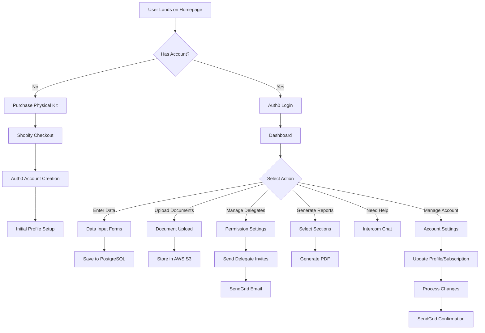
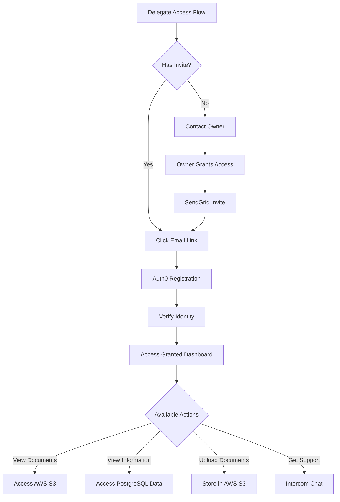
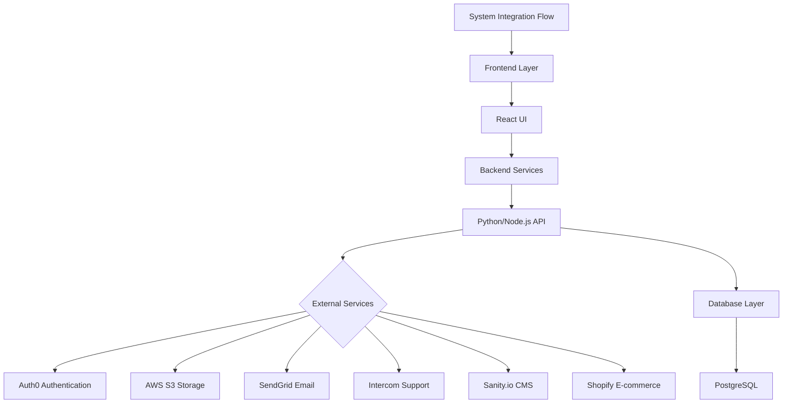
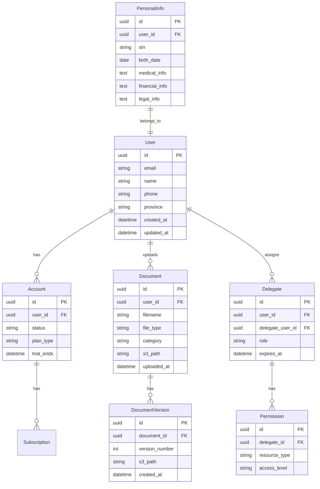
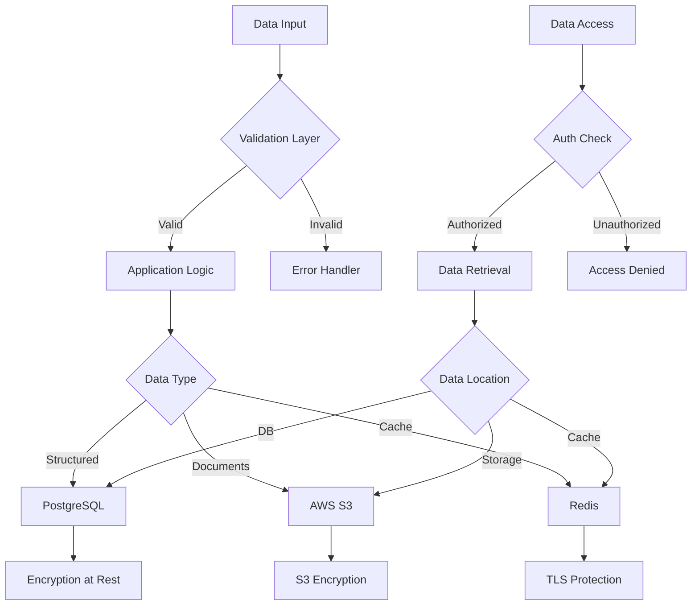
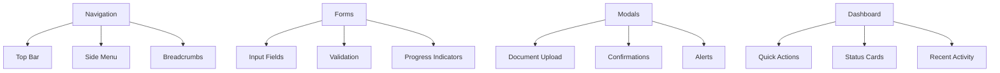
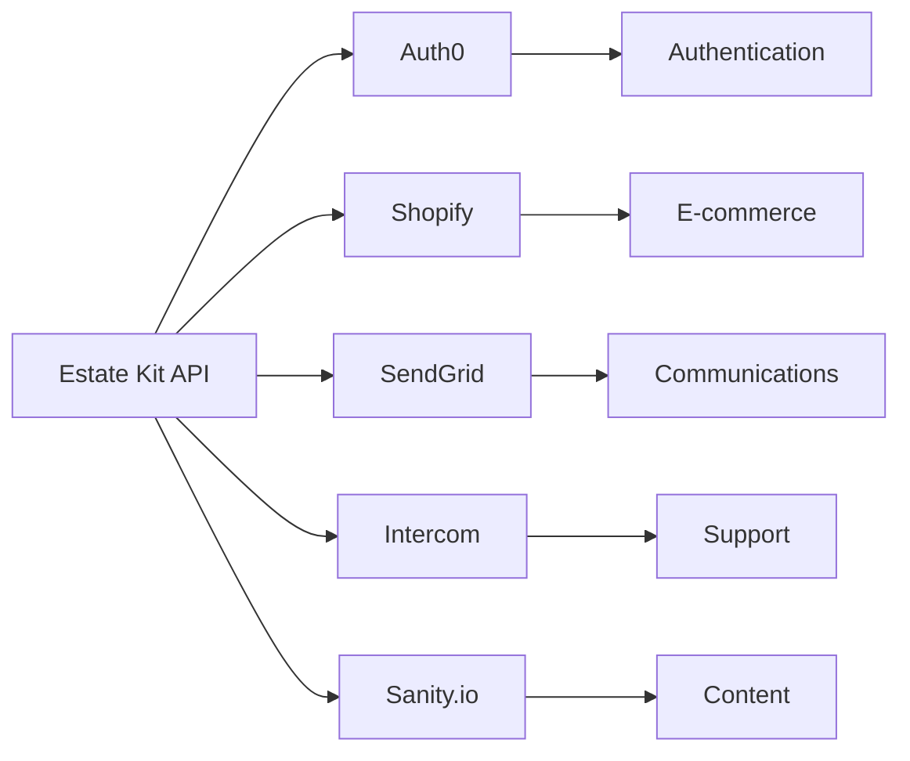

# Product Requirements Document (PRD)

# 1. INTRODUCTION

## 1.1 Purpose

This Software Requirements Specification (SRS) document provides a comprehensive description of the Estate Kit web application. It details the functional, technical, and business requirements for developers, project managers, QA teams, and stakeholders involved in the development and implementation process.

## 1.2 Scope

Estate Kit is a web-based estate planning platform that combines physical organization tools with a secure digital vault. The system will:

- Guide users through comprehensive estate planning with step-by-step data collection
- Provide secure digital storage for sensitive documents and information
- Enable role-based access control for delegates (executors, healthcare proxies, etc.)
- Generate formatted PDF outputs of stored information
- Integrate with e-commerce for physical kit fulfillment
- Deliver jurisdiction-specific guidance for Canadian provinces
- Ensure security compliance with PIPEDA and HIPAA standards
- Offer accessible, senior-friendly user interface
- Provide customer support through integrated chat functionality
- Manage subscription-based access to digital services

Key technical components include:

- React frontend with Material UI
- Python/Node.js backend
- PostgreSQL database
- AWS S3 storage
- Integrations with Auth0, Shopify, SendGrid, Intercom, and Sanity.io

Out of scope:

- Legal advice or document preparation
- Direct integration with government systems
- Mobile applications
- Offline functionality
- Multi-language support (initial release)

# 2. PRODUCT DESCRIPTION

## 2.1 Product Perspective

Estate Kit operates as a standalone web application while integrating with several external systems:

- Auth0 for identity management and authentication
- Shopify for e-commerce and subscription management
- AWS S3 for secure document storage
- SendGrid for communication services
- Intercom for customer support
- Sanity.io for content management

The system architecture follows a modern microservices approach with:

- React frontend
- Python/Node.js backend API services
- PostgreSQL database for structured data
- AWS cloud infrastructure

## 2.2 Product Functions

The primary functions include:

- Estate planning data collection and organization
- Secure digital document storage and management
- Role-based access control for delegates
- PDF generation and document formatting
- Physical kit e-commerce integration
- Province-specific resource delivery
- Account and subscription management
- Third-party document upload requests
- Email/SMS notifications
- Real-time customer support

## 2.3 User Characteristics

Primary Users (Account Owners):

- Adults aged 60+ planning their estates
- Moderate to low technical proficiency
- Value security and privacy
- Prefer clear, straightforward interfaces
- May have physical limitations requiring accessibility features

Secondary Users (Delegates):

- Executors: Legal professionals or family members requiring comprehensive access
- Healthcare Proxies: Medical professionals or family members needing health-related information
- Family Members: Various ages and technical abilities requiring specific information access
- Professional Advisors: Lawyers, accountants, and financial advisors requiring secure document upload capabilities

## 2.4 Constraints

Technical Constraints:

- Must maintain PIPEDA and HIPAA compliance standards
- Browser compatibility requirements for older systems
- File size limitations for uploads (determined by AWS S3)
- API rate limits from third-party services
- Database storage limitations

Regulatory Constraints:

- Canadian privacy laws and regulations
- Provincial estate planning requirements
- Digital signature regulations
- Data retention policies

Business Constraints:

- Subscription pricing model limitations
- Customer support hours and response times
- Integration costs with third-party services
- Infrastructure scaling costs

## 2.5 Assumptions and Dependencies

Assumptions:

- Users have basic internet access and web browsing capabilities
- Primary users can perform basic digital tasks (email, web forms)
- Users have access to physical documents for scanning/uploading
- Canadian legal framework remains stable

Dependencies:

- Continuous availability of third-party services (Auth0, Shopify, etc.)
- AWS infrastructure reliability
- Internet connectivity for users
- Browser support for required features
- Timely content updates from legal/jurisdictional sources
- Stable API versions from integration partners

# 3. PROCESS FLOWCHART

4. FUNCTIONAL REQUIREMENTS

## 4.1 User Authentication and Account Management

### ID: F001

### Description: User registration, authentication, and account management functionality

### Priority: High

### Requirements:

| ID | Requirement | Acceptance Criteria |
| --- | --- | --- |
| F001.1 | User registration via Auth0 | - Support email/password registration - Validate email format - Enforce password complexity rules - Send verification email |
| F001.2 | User login | - Auth0 integration for secure login - Support passwordless options - Implement session management - Handle login errors gracefully |
| F001.3 | Account settings management | - Allow profile information updates - Enable password changes - Display subscription status - Show billing history |
| F001.4 | Subscription management | - Display current plan details - Support plan upgrades/downgrades - Process subscription cancellations - Generate invoices/receipts |

## 4.2 Estate Data Collection

### ID: F002

### Description: Comprehensive data collection for estate planning

### Priority: High

### Requirements:

| ID | Requirement | Acceptance Criteria |
| --- | --- | --- |
| F002.1 | Personal information collection | - Capture basic demographics - Validate SIN/SSN format - Store contact details - Support address validation |
| F002.2 | Financial information | - Record bank accounts - Store investment details - Track insurance policies - Log property information |
| F002.3 | Healthcare directives | - Capture medical preferences - Store healthcare proxy details - Record medication information - Document medical history |
| F002.4 | Legal documentation | - Store will information - Track power of attorney details - Record trust documents - Log legal contacts |

## 4.3 Document Management

### ID: F003

### Description: Secure document upload and storage functionality

### Priority: High

### Requirements:

| ID | Requirement | Acceptance Criteria |
| --- | --- | --- |
| F003.1 | Document upload | - Support drag-and-drop uploads - Allow multiple file selection - Validate file types/sizes - Show upload progress |
| F003.2 | Document storage | - Encrypt files in AWS S3 - Organize by categories - Enable version control - Implement backup system |
| F003.3 | Third-party uploads | - Generate secure upload links - Send email invitations via SendGrid - Track upload status - Notify owner of uploads |
| F003.4 | Document retrieval | - Enable quick search - Support file preview - Allow secure downloads - Track access history |

## 4.4 Delegate Access Control

### ID: F004

### Description: Role-based access management for delegates

### Priority: High

### Requirements:

| ID | Requirement | Acceptance Criteria |
| --- | --- | --- |
| F004.1 | Delegate invitation | - Generate secure invites - Send via SendGrid - Track invitation status - Support invitation expiry |
| F004.2 | Permission management | - Define role-based access - Enable granular permissions - Support permission updates - Log access changes |
| F004.3 | Delegate authentication | - Verify delegate identity - Enforce 2FA for sensitive roles - Manage delegate sessions - Track login history |
| F004.4 | Access revocation | - Enable immediate revocation - Notify affected delegates - Clear active sessions - Log revocation events |

## 4.5 PDF Generation

### ID: F005

### Description: Generation of formatted PDF documents

### Priority: Medium

### Requirements:

| ID | Requirement | Acceptance Criteria |
| --- | --- | --- |
| F005.1 | PDF creation | - Generate formatted documents - Include all selected data - Support custom templates - Enable section selection |
| F005.2 | Sensitive data handling | - Include full sensitive data - Apply watermarks - Track PDF generation - Enable password protection |
| F005.3 | Batch processing | - Support multiple section export - Enable bulk downloads - Show generation progress - Handle timeouts gracefully |
| F005.4 | PDF management | - Store generated PDFs - Enable re-download - Track download history - Support PDF deletion |

## 4.6 E-commerce Integration

### ID: F006

### Description: Integration with Shopify for physical kit sales

### Priority: High

### Requirements:

| ID | Requirement | Acceptance Criteria |
| --- | --- | --- |
| F006.1 | Product management | - Sync with Shopify catalog - Display product details - Show inventory status - Update pricing automatically |
| F006.2 | Checkout process | - Integrate Shopify checkout - Handle payment processing - Support discount codes - Process shipping options |
| F006.3 | Order fulfillment | - Track order status - Send order confirmations - Handle shipping updates - Process returns if needed |
| F006.4 | Subscription setup | - Link physical kit to subscription - Activate digital access - Send welcome emails - Track subscription start |

## 4.7 Support Integration

### ID: F007

### Description: Integration with Intercom for customer support

### Priority: Medium

### Requirements:

| ID | Requirement | Acceptance Criteria |
| --- | --- | --- |
| F007.1 | Chat functionality | - Embed Intercom widget - Enable real-time chat - Support file sharing - Track chat history |
| F007.2 | Help resources | - Display FAQs - Provide guided tours - Show contextual help - Support search functionality |
| F007.3 | Ticket management | - Create support tickets - Track ticket status - Enable email notifications - Store ticket history |
| F007.4 | Knowledge base | - Integrate help articles - Enable article search - Track article views - Support content updates |

# 5. NON-FUNCTIONAL REQUIREMENTS

## 5.1 Performance Requirements

| Category | Requirement | Target Metric |
| --- | --- | --- |
| Response Time | Page Load Time | \< 3 seconds for initial load |
|  | API Response Time | \< 500ms for 95% of requests |
|  | PDF Generation | \< 10 seconds for complete document |
| Throughput | Concurrent Users | Support 5000+ simultaneous users |
|  | File Upload Speed | Process 10MB/s minimum |
| Resource Usage | CPU Utilization | \< 70% under normal load |
|  | Memory Usage | \< 2GB per server instance |
|  | Database Connections | Maximum 500 concurrent connections |

## 5.2 Safety Requirements

| Category | Requirement | Implementation |
| --- | --- | --- |
| Data Backup | Regular Backups | Daily automated backups with 30-day retention |
|  | Backup Testing | Monthly restoration tests |
| Failure Recovery | System Redundancy | Multi-AZ deployment in AWS |
|  | Failover Time | \< 5 minutes automatic failover |
| Error Handling | Data Validation | Input validation before storage |
|  | Error Logging | Comprehensive error tracking and alerts |
| Data Loss Prevention | Auto-save | Every 30 seconds during form completion |
|  | Version Control | Document version history for 90 days |

## 5.3 Security Requirements

| Category | Requirement | Implementation |
| --- | --- | --- |
| Authentication | Multi-factor Authentication | Required for sensitive operations |
|  | Session Management | 30-minute timeout, secure cookie handling |
| Authorization | Role-based Access | Granular permission controls |
|  | Access Logging | Audit trail of all data access |
| Encryption | Data at Rest | AES-256 encryption for stored data |
|  | Data in Transit | TLS 1.3 for all communications |
| Privacy | Data Masking | Masked display of sensitive information |
|  | Data Retention | Configurable retention policies |

## 5.4 Quality Requirements

| Category | Requirement | Target Metric |
| --- | --- | --- |
| Availability | Uptime | 99.9% availability |
|  | Planned Maintenance | \< 4 hours monthly downtime |
| Maintainability | Code Coverage | Minimum 80% test coverage |
|  | Documentation | Updated within 24 hours of changes |
| Usability | WCAG Compliance | WCAG 2.1 Level AA compliance |
|  | Error Messages | Clear, actionable error messages |
| Scalability | Horizontal Scaling | Auto-scaling based on load |
|  | Storage Scaling | Automatic storage expansion |
| Reliability | Mean Time Between Failures | \> 720 hours |
|  | Recovery Time Objective | \< 4 hours |

## 5.5 Compliance Requirements

| Category | Requirement | Implementation |
| --- | --- | --- |
| Privacy Laws | PIPEDA Compliance | Full compliance with Canadian privacy laws |
|  | HIPAA Standards | Healthcare data protection standards |
| Security Standards | SOC 2 Type II | Annual certification maintenance |
|  | PCI DSS | Compliance for payment processing |
| Accessibility | ADA Compliance | Full compliance with ADA standards |
|  | AODA Compliance | Ontario accessibility standards |
| Data Governance | Data Residency | Canadian data center requirements |
|  | Audit Requirements | Quarterly security audits |

## 5.6 Browser Support Requirements

| Browser | Minimum Version | Notes |
| --- | --- | --- |
| Chrome | 90+ | Full feature support |
| Firefox | 88+ | Full feature support |
| Safari | 14+ | Full feature support |
| Edge | 90+ | Full feature support |
| IE | Not Supported | Redirect to modern browser |

## 5.7 Infrastructure Requirements

| Category | Requirement | Specification |
| --- | --- | --- |
| Server Environment | AWS | EC2 t3.large minimum |
| Database | PostgreSQL | Version 13+ |
| CDN | CloudFront | Edge locations in all Canadian regions |
| Monitoring | CloudWatch | 99% monitoring coverage |
| Backup Storage | S3 | Standard-IA storage class |

# 6. DATA REQUIREMENTS

## 6.1 Data Models

## 6.2 Data Storage

### 6.2.1 Primary Storage

| Data Type | Storage Solution | Encryption | Access Pattern |
| --- | --- | --- | --- |
| User Data | PostgreSQL | AES-256 at rest | Read-heavy, ACID compliant |
| Documents | AWS S3 | Server-side encryption | Write once, read many |
| Session Data | Redis | TLS in transit | High-frequency access |
| Audit Logs | CloudWatch | AWS managed | Write-heavy, sequential reads |

### 6.2.2 Data Retention

| Data Category | Retention Period | Archive Strategy | Deletion Policy |
| --- | --- | --- | --- |
| User Accounts | Indefinite | Active in PostgreSQL | On request only |
| Documents | 7 years | S3 lifecycle to Glacier | Soft delete |
| Audit Logs | 2 years | CloudWatch to S3 | Automatic purge |
| Session Data | 30 days | None | Automatic expiry |

### 6.2.3 Backup Strategy

| Component | Backup Frequency | Retention | Recovery Time |
| --- | --- | --- | --- |
| PostgreSQL | Daily full, 15-min WAL | 30 days | \< 4 hours |
| S3 Documents | Cross-region replication | Continuous | \< 1 hour |
| Redis Cache | Daily snapshot | 7 days | \< 30 minutes |
| Configuration | Git version control | Indefinite | \< 15 minutes |

## 6.3 Data Processing

### 6.3.1 Data Security Controls

| Security Layer | Implementation | Purpose |
| --- | --- | --- |
| Encryption at Rest | AES-256 | Protect stored data |
| Transport Security | TLS 1.3 | Secure data in transit |
| Access Control | Role-based (RBAC) | Granular permissions |
| Data Masking | Dynamic masking | Hide sensitive fields |
| Key Management | AWS KMS | Encryption key rotation |

### 6.3.2 Data Processing Rules

| Process | Rule | Implementation |
| --- | --- | --- |
| Input Validation | Server-side validation | Express/Python validators |
| SIN/SSN Format | Regex pattern matching | Pre-save hooks |
| File Upload | Size/type restrictions | S3 presigned URLs |
| Data Updates | Audit trail creation | Database triggers |
| Delegate Access | Time-based expiry | Scheduled jobs |

### 6.3.3 Data Integration Points

| System | Integration Type | Data Flow |
| --- | --- | --- |
| Auth0 | REST API | User authentication |
| Shopify | Webhooks | Order/subscription data |
| SendGrid | API | Email notifications |
| Intercom | JavaScript SDK | Support interactions |
| Sanity.io | GraphQL | Content delivery |

# 7. EXTERNAL INTERFACES

## 7.1 User Interfaces

### 7.1.1 General Requirements

| Requirement | Description |
| --- | --- |
| Framework | React with Material UI components |
| Accessibility | WCAG 2.1 Level AA compliance |
| Responsive Design | Support viewport sizes 320px to 2560px |
| Color Scheme | High contrast ratios (minimum 4.5:1) |
| Font Sizes | Minimum 16px base size, scalable up to 200% |

### 7.1.2 Core Interface Components

### 7.1.3 Interface Guidelines

| Component | Specification |
| --- | --- |
| Buttons | Minimum 44x44px touch target |
| Form Fields | Clear labels, visible focus states |
| Error Messages | Inline validation, clear error text |
| Loading States | Animated spinners, progress bars |
| Navigation | Consistent placement, clear hierarchy |

## 7.2 Hardware Interfaces

### 7.2.1 Client Hardware Requirements

| Device Type | Minimum Requirements |
| --- | --- |
| Desktop/Laptop | Modern browser, 1024x768 resolution |
| Tablet | iOS 14+ or Android 8+ |
| Storage | 50MB free space for cache |
| Network | 1Mbps stable connection |

### 7.2.2 Server Hardware Requirements

| Component | Specification |
| --- | --- |
| AWS EC2 | t3.large instances |
| Storage | EBS gp3 volumes, minimum 100GB |
| Network | 1Gbps dedicated bandwidth |
| Load Balancer | Application Load Balancer |

## 7.3 Software Interfaces

### 7.3.1 External Service Integrations

| Service | Interface Type | Purpose |
| --- | --- | --- |
| Auth0 | REST API | Authentication and user management |
| Shopify | REST API/Webhooks | E-commerce and subscription management |
| SendGrid | REST API | Email and SMS communications |
| Intercom | JavaScript SDK | Customer support integration |
| Sanity.io | GraphQL API | Content management system |

### 7.3.2 Database Interfaces

| System | Interface Type | Usage |
| --- | --- | --- |
| PostgreSQL | SQL/ORM | Primary data storage |
| Redis | Redis Protocol | Session and cache management |
| AWS S3 | REST API | Document storage |

### 7.3.3 Operating System Interfaces

| Component | Requirement |
| --- | --- |
| Server OS | Linux (Ubuntu 20.04 LTS) |
| Container Runtime | Docker 20+ |
| Process Manager | PM2 for Node.js |

## 7.4 Communication Interfaces

### 7.4.1 Network Protocols

| Protocol | Usage | Port |
| --- | --- | --- |
| HTTPS | All web traffic | 443 |
| WSS | Real-time updates | 443 |
| SMTP | Email delivery | 587 |
| PostgreSQL | Database connection | 5432 |

### 7.4.2 API Specifications

| Category | Specification |
| --- | --- |
| REST API | OpenAPI 3.0 compliant |
| Authentication | JWT tokens via Auth0 |
| Rate Limiting | 1000 requests/minute |
| Timeout | 30 second maximum |

### 7.4.3 Data Exchange Formats

| Format | Usage |
| --- | --- |
| JSON | API responses |
| PDF | Document generation |
| CSV | Data exports |
| Multipart | File uploads |

### 7.4.4 Integration Endpoints

# 8. APPENDICES

## 8.1 GLOSSARY

| Term | Definition |
| --- | --- |
| Delegate | A person granted specific access rights to view or manage portions of an estate plan (e.g., executor, healthcare proxy) |
| Digital Vault | Secure online storage system for sensitive documents and information |
| Estate Kit | Combined physical organization system and digital platform for estate planning |
| Estate Plan | Comprehensive collection of documents and information for end-of-life planning |
| Healthcare Proxy | Person designated to make medical decisions if the account owner becomes incapacitated |
| Physical Kit | Tangible organizational system shipped to users for storing physical documents |
| Role-based Access | System of permissions that grants specific capabilities based on assigned user roles |
| Sensitive Information | Protected data including SIN/SSN, financial details, and medical information |

## 8.2 ACRONYMS

| Acronym | Full Form |
| --- | --- |
| ADA | Americans with Disabilities Act |
| AODA | Accessibility for Ontarians with Disabilities Act |
| API | Application Programming Interface |
| AWS | Amazon Web Services |
| CDN | Content Delivery Network |
| CI/CD | Continuous Integration/Continuous Deployment |
| CMS | Content Management System |
| GDPR | General Data Protection Regulation |
| HIPAA | Health Insurance Portability and Accountability Act |
| IAM | Identity and Access Management |
| JWT | JSON Web Token |
| KMS | Key Management Service |
| PIPEDA | Personal Information Protection and Electronic Documents Act |
| RBAC | Role-Based Access Control |
| RPO | Recovery Point Objective |
| S3 | Simple Storage Service |
| SIN | Social Insurance Number |
| SLA | Service Level Agreement |
| SSN | Social Security Number |
| SSR | Server-Side Rendering |
| TLS | Transport Layer Security |
| UI | User Interface |
| UX | User Experience |
| WCAG | Web Content Accessibility Guidelines |

## 8.3 ADDITIONAL REFERENCES

| Category | Reference | URL/Location |
| --- | --- | --- |
| Authentication | Auth0 Documentation | https://auth0.com/docs |
| E-commerce | Shopify API Reference | https://shopify.dev/api |
| Email Service | SendGrid API Documentation | https://docs.sendgrid.com |
| Storage | AWS S3 Documentation | https://docs.aws.amazon.com/s3 |
| Support | Intercom Developer Hub | https://developers.intercom.com |
| Content Management | Sanity.io Documentation | https://www.sanity.io/docs |
| Security Standards | PIPEDA Guidelines | https://www.priv.gc.ca/en/privacy-topics/privacy-laws-in-canada/pipeda |
| Accessibility | WCAG 2.1 Guidelines | https://www.w3.org/WAI/standards-guidelines/wcag |
| Development | React Documentation | https://reactjs.org/docs |
| Development | Material UI Components | https://mui.com/getting-started/usage |
| Database | PostgreSQL Documentation | https://www.postgresql.org/docs |