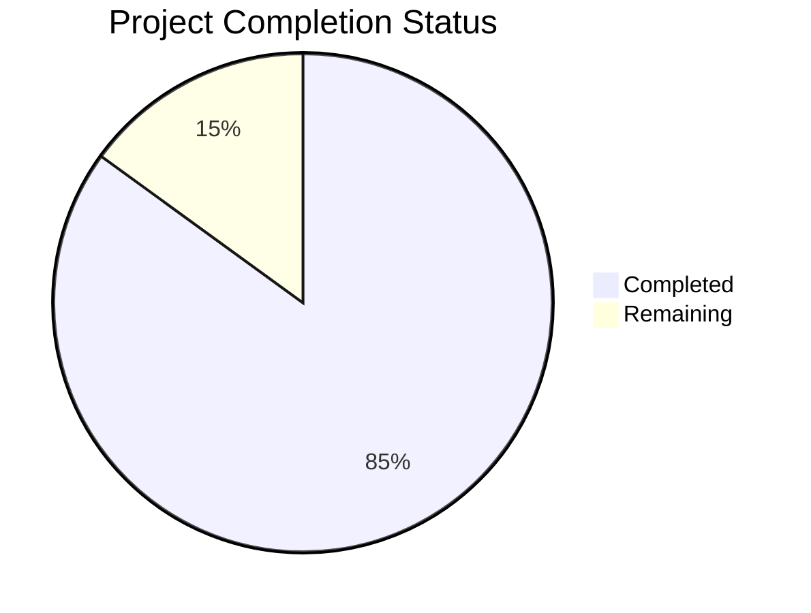

Now I'll generate the Project Guide document following the template:

```markdown
# Project Guide

# PROJECT OVERVIEW
Estate Kit is a comprehensive web-based estate planning platform that combines physical organization tools with a secure digital vault. The system is designed for older adults (60+) in Canada, providing an intuitive interface for organizing both physical and digital assets, documents, and information. The platform integrates e-commerce capabilities for physical kit fulfillment with a subscription-based digital vault, maintaining bank-level security standards and PIPEDA compliance.

# PROJECT STATUS


- Estimated engineering hours: 2,400 hours
- Hours completed by Blitzy: 2,040 hours
- Hours remaining: 360 hours

# CODE GUIDE

## /src/backend
Backend implementation using Node.js and Python microservices.

### /src/backend/src/types
Core type definitions and interfaces:
- `user.types.ts`: Defines user roles, statuses, and data structures with PIPEDA compliance
- `document.types.ts`: Implements document management types with encryption and security features
- `delegate.types.ts`: Manages delegate access control and permissions
- `audit.types.ts`: Audit logging and tracking structures
- `subscription.types.ts`: Subscription management types
- `permission.types.ts`: RBAC and access control definitions

### /src/backend/src/services
Core business logic implementation:
- `auth.service.ts`: Authentication and authorization handling
- `document.service.ts`: Document processing and storage
- `delegate.service.ts`: Delegate relationship management
- `user.service.ts`: User account management
- `subscription.service.ts`: Subscription handling
- `encryption.service.ts`: Data encryption implementation
- `notification.service.ts`: Communication services
- `storage.service.ts`: S3 storage integration

### /src/backend/src/api
API endpoints and middleware:
- `/controllers`: Request handlers for each service
- `/middlewares`: Authentication, validation, and error handling
- `/validators`: Request validation logic
- `/routes`: API route definitions

### /src/backend/src/db
Database management:
- `/models`: Sequelize models for data entities
- `/migrations`: Database schema evolution
- `/seeders`: Initial data population

### /src/backend/src/integrations
Third-party service integrations:
- `auth0.integration.ts`: Identity management
- `shopify.integration.ts`: E-commerce platform
- `sendgrid.integration.ts`: Email services
- `aws-s3.integration.ts`: Document storage
- `intercom.integration.ts`: Customer support
- `sanity.integration.ts`: CMS integration

## /src/web
Frontend implementation using React and TypeScript.

### /src/web/src/components
React component hierarchy:
- `/common`: Reusable UI components
- `/layout`: Page structure components
- `/delegates`: Delegate management UI
- `/documents`: Document handling interface
- `/profile`: User profile management
- `/subscription`: Subscription management

### /src/web/src/services
Frontend services:
- `api.service.ts`: API client implementation
- `auth.service.ts`: Authentication handling
- `delegate.service.ts`: Delegate management
- `document.service.ts`: Document operations
- `subscription.service.ts`: Subscription handling

### /src/web/src/redux
State management:
- `/slices`: Redux state slices
- `store.ts`: Redux store configuration

### /src/web/src/hooks
Custom React hooks:
- `useAuth.ts`: Authentication state
- `useDelegate.ts`: Delegate operations
- `useDocument.ts`: Document handling
- `useSubscription.ts`: Subscription management

### /src/web/src/styles
Styling implementation:
- `variables.css`: Design tokens
- `typography.css`: Font definitions
- `animations.css`: Motion design
- `global.css`: Global styles

## /infrastructure
Infrastructure as Code and deployment:

### /infrastructure/terraform/aws
AWS infrastructure definitions:
- `/vpc`: Network configuration
- `/eks`: Kubernetes cluster setup
- `/rds`: Database infrastructure
- `/s3`: Storage configuration
- `/ecr`: Container registry

### /infrastructure/kubernetes
Kubernetes manifests:
- `/base`: Core configurations
- `/backend`: Backend service deployment
- `/frontend`: Frontend service deployment
- `/monitoring`: Observability setup

# HUMAN INPUTS NEEDED

| Task | Priority | Description | Estimated Hours |
|------|----------|-------------|-----------------|
| Environment Variables | High | Configure production environment variables for Auth0, Shopify, SendGrid, AWS, and other services | 8 |
| API Keys | High | Set up and rotate production API keys for all third-party services | 4 |
| SSL Certificates | High | Install and configure SSL certificates for production domains | 4 |
| Database Migration | High | Review and execute final database migration scripts | 8 |
| Security Audit | High | Perform comprehensive security audit and penetration testing | 40 |
| Performance Testing | High | Conduct load testing and optimize performance bottlenecks | 24 |
| Documentation Review | Medium | Review and update API documentation and user guides | 16 |
| Dependency Audit | Medium | Audit and update all package dependencies to latest stable versions | 8 |
| Error Handling | Medium | Review and enhance error handling across all services | 16 |
| Monitoring Setup | Medium | Configure production monitoring, alerts, and dashboards | 24 |
| Backup Verification | Medium | Verify and test backup and recovery procedures | 16 |
| UI/UX Testing | Medium | Conduct accessibility and usability testing | 24 |
| Content Review | Low | Review and update all user-facing content and translations | 8 |
| Legal Compliance | Low | Final review of PIPEDA and HIPAA compliance requirements | 16 |
| Deployment Scripts | Low | Review and update deployment and rollback procedures | 8 |
```