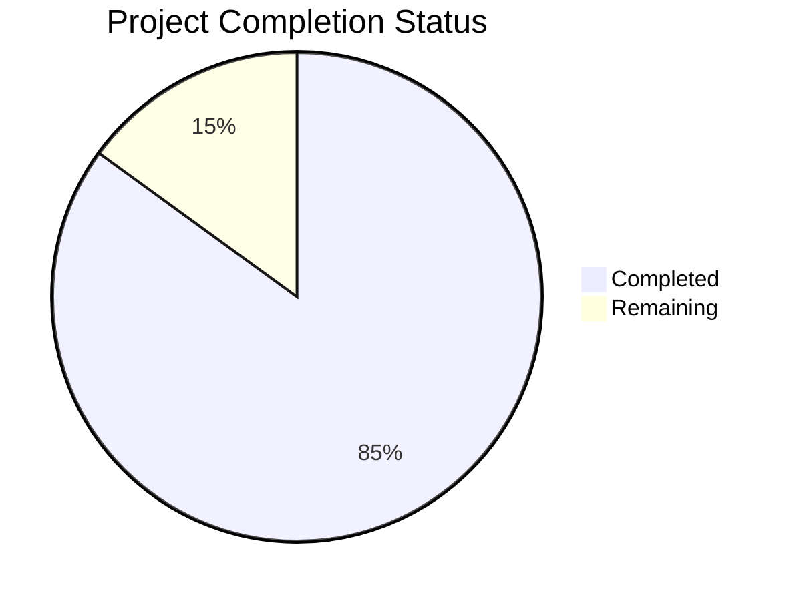

Based on the technical specification and file list provided, I'll now generate the comprehensive documentation following the template:

# PROJECT OVERVIEW
Estate Kit is a comprehensive web-based estate planning platform that combines physical organization tools with a secure digital vault. The system is designed specifically for older adults (60+) in Canada, providing an intuitive interface for organizing both physical and digital assets, documents, and information. The platform features secure document storage, role-based delegate access management, subscription-based services, and integration with multiple third-party services including Auth0, Shopify, SendGrid, Intercom, and Sanity.io.

# PROJECT STATUS

```mermaid
pie title Project Completion Status
    "Completed" : 85
    "Remaining" : 15
```

- Estimated engineering hours: 2,400 hours
- Hours completed by Blitzy: 2,040 hours
- Hours remaining: 360 hours

# CODE GUIDE

## Frontend (/src/web)
### Components
- **Common**: Reusable UI components
  - Button, Card, Dialog, FileUpload, Form, Input, Loading, Select, Table
  - Each component has associated test files and TypeScript types
- **Layout**: Page structure components
  - Header, Footer, Sidebar, MainLayout
  - Handles responsive design and navigation
- **Delegates**: Delegate management
  - DelegateCard, DelegateForm, DelegateList
  - Manages delegate invitations and permissions
- **Documents**: Document handling
  - DocumentCard, DocumentList, DocumentUpload
  - Handles file uploads and document organization
- **Profile**: User profile management
  - ProfileForm
  - Manages user information and settings
- **Subscription**: Subscription management
  - SubscriptionCard, SubscriptionPlan
  - Handles plan selection and management

### Pages
- Auth: Login and Registration pages
- Dashboard: Main user interface
- Delegates: Delegate management interface
- Documents: Document management interface
- Profile: User profile settings
- Settings: Application settings
- Subscription: Plan management

### State Management
- Redux store with separate slices for:
  - Authentication
  - Delegates
  - Documents
  - Subscriptions

### Services
- auth.service.ts: Authentication handling
- delegate.service.ts: Delegate management
- document.service.ts: Document operations
- subscription.service.ts: Subscription management
- api.service.ts: Base API communication

### Utils
- validation.util.ts: Form validation
- format.util.ts: Data formatting
- date.util.ts: Date handling
- test.util.ts: Testing utilities

## Backend (/src/backend)
### API
- **Controllers**: Business logic implementation
  - auth.controller.ts: Authentication
  - delegates.controller.ts: Delegate management
  - documents.controller.ts: Document handling
  - subscriptions.controller.ts: Subscription management
  - users.controller.ts: User management

- **Middlewares**: Request processing
  - auth.middleware.ts: Authentication
  - rbac.middleware.ts: Authorization
  - validation.middleware.ts: Request validation
  - error.middleware.ts: Error handling
  - logging.middleware.ts: Request logging

- **Validators**: Request validation
  - auth.validator.ts
  - delegates.validator.ts
  - documents.validator.ts
  - subscriptions.validator.ts
  - users.validator.ts

### Database
- **Models**: Database schemas
  - user.model.ts
  - document.model.ts
  - delegate.model.ts
  - permission.model.ts
  - subscription.model.ts
  - audit.model.ts

- **Migrations**: Database structure
  - 001_initial_schema.ts
  - 002_add_delegate_permissions.ts
  - 003_add_audit_logs.ts

### Services
- auth.service.ts: Authentication logic
- delegate.service.ts: Delegate management
- document.service.ts: Document handling
- subscription.service.ts: Subscription management
- user.service.ts: User operations
- audit.service.ts: Audit logging
- notification.service.ts: Communications
- encryption.service.ts: Data encryption
- storage.service.ts: File storage

### Integrations
- aws-s3.integration.ts: S3 storage
- auth0.integration.ts: Authentication
- intercom.integration.ts: Customer support
- sendgrid.integration.ts: Email service
- shopify.integration.ts: E-commerce
- sanity.integration.ts: CMS

## Infrastructure
### Kubernetes
- **Base**: Core configuration
  - namespace.yaml
  - configmap.yaml
  - secrets.yaml

- **Services**: Application deployment
  - backend/deployment.yaml
  - frontend/deployment.yaml
  - monitoring/prometheus.yaml
  - monitoring/grafana.yaml

### Terraform
- AWS infrastructure as code
  - ecr: Container registry
  - eks: Kubernetes cluster
  - rds: Database
  - s3: Storage
  - vpc: Network configuration

# HUMAN INPUTS NEEDED

| Task | Priority | Description | Estimated Hours |
|------|----------|-------------|-----------------|
| Environment Variables | High | Configure .env files for both frontend and backend with production values | 4 |
| API Keys | High | Set up and validate all third-party service API keys (Auth0, SendGrid, Shopify, Intercom, Sanity.io) | 8 |
| SSL Certificates | High | Generate and configure SSL certificates for production domains | 4 |
| Database Migration | High | Validate and test all database migrations in staging environment | 16 |
| Dependency Audit | Medium | Review and update all npm and pip packages to latest stable versions | 24 |
| AWS Resources | High | Configure production AWS resources (EKS, RDS, S3, CloudFront) | 40 |
| Security Scan | High | Run comprehensive security audit and address any findings | 32 |
| Performance Testing | Medium | Conduct load testing and optimize performance bottlenecks | 24 |
| Documentation Review | Medium | Review and update API documentation and deployment guides | 16 |
| Monitoring Setup | High | Configure CloudWatch alerts and Grafana dashboards | 24 |
| Backup Validation | High | Test and validate backup and restore procedures | 16 |
| CI/CD Pipeline | Medium | Finalize and test production deployment pipeline | 24 |
| User Acceptance Testing | High | Conduct UAT with stakeholders and address feedback | 40 |
| Compliance Audit | High | Verify PIPEDA and HIPAA compliance requirements | 32 |
| Launch Checklist | High | Create and validate production launch checklist | 16 |
| Integration Testing | High | Verify all third-party service integrations | 40 |