# Technical Specifications

# 1. INTRODUCTION

## 1.1 EXECUTIVE SUMMARY

Estate Kit is a comprehensive web-based estate planning platform that combines physical organization tools with a secure digital vault. The system addresses the critical need for simplified estate planning among older adults (60+) by providing an intuitive interface for organizing both physical and digital assets, documents, and information.

The platform solves the fundamental challenge of scattered and disorganized estate information by centralizing storage, enabling secure delegate access, and providing jurisdiction-specific guidance for Canadian provinces. By integrating e-commerce capabilities for physical kit fulfillment with a subscription-based digital vault, Estate Kit delivers a hybrid solution that meets the diverse needs of estate planning while maintaining bank-level security standards.

## 1.2 SYSTEM OVERVIEW

### Project Context

| Aspect | Details |
|--------|----------|
| Market Position | First-to-market hybrid physical/digital estate planning solution for Canadian market |
| Target Users | Primary: Adults 60+ planning estates<br>Secondary: Executors, healthcare proxies, family members, professional advisors |
| Enterprise Integration | Standalone system with integrations to Auth0, Shopify, SendGrid, Intercom, and Sanity.io |

### High-Level Description

| Component | Implementation |
|-----------|----------------|
| Frontend | React-based web application with Material UI for accessibility |
| Backend | Python/Node.js API services with PostgreSQL database |
| Storage | AWS S3 for encrypted document storage |
| Security | PIPEDA and HIPAA-compliant architecture |
| Integrations | Auth0 (authentication), Shopify (e-commerce), SendGrid (communications), Intercom (support), Sanity.io (CMS) |

### Success Criteria

| Category | Metrics |
|----------|----------|
| User Adoption | - 5,000 active subscribers within 12 months<br>- 80% completion rate of estate profiles |
| Performance | - 99.9% system uptime<br>- < 3 second page load times<br>- < 500ms API response time |
| Security | - Zero data breaches<br>- 100% compliance with PIPEDA standards |
| User Satisfaction | - 90% user satisfaction rating<br>- < 5% subscription churn rate |

## 1.3 SCOPE

### In-Scope

| Category | Components |
|----------|------------|
| Core Features | - Secure digital vault for document storage<br>- Role-based delegate access management<br>- PDF generation and formatting<br>- Province-specific resource delivery<br>- Physical kit e-commerce integration |
| User Management | - Account creation and authentication<br>- Subscription management<br>- Delegate access control<br>- User profile management |
| Data Security | - Encryption at rest and in transit<br>- Role-based access control<br>- Audit logging<br>- Automated backups |
| Integrations | - Authentication (Auth0)<br>- E-commerce (Shopify)<br>- Email/SMS (SendGrid)<br>- Support (Intercom)<br>- Content (Sanity.io) |

### Out-of-Scope

| Category | Exclusions |
|----------|------------|
| Features | - Legal document preparation<br>- Direct government system integration<br>- Mobile applications<br>- Offline functionality |
| Geographic Coverage | - Non-Canadian jurisdictions<br>- Multi-language support |
| Technical Components | - Custom mobile apps<br>- Blockchain integration<br>- AI-powered document analysis<br>- Real-time video conferencing |
| Support Services | - Legal advice<br>- Financial planning<br>- Estate execution services<br>- Document notarization |

# 2. SYSTEM ARCHITECTURE

## 2.1 High-Level Architecture

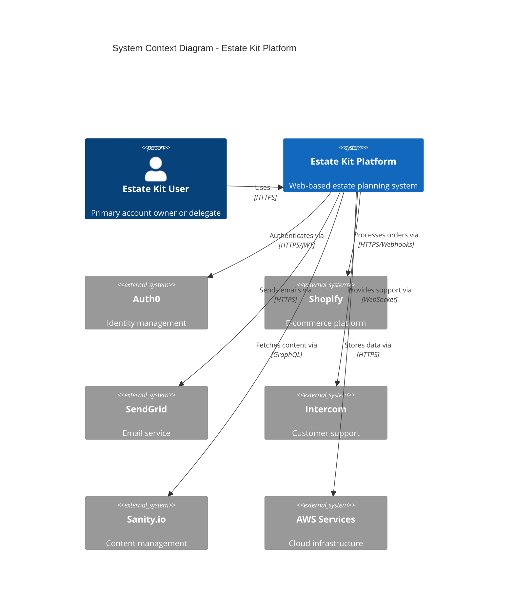
```mermaid
C4Context
    title System Context Diagram - Estate Kit Platform

    Person(user, "Estate Kit User", "Primary account owner or delegate")
    System(estateKit, "Estate Kit Platform", "Web-based estate planning system")
    
    System_Ext(auth0, "Auth0", "Identity management")
    System_Ext(shopify, "Shopify", "E-commerce platform")
    System_Ext(sendgrid, "SendGrid", "Email service")
    System_Ext(intercom, "Intercom", "Customer support")
    System_Ext(sanity, "Sanity.io", "Content management")
    System_Ext(aws, "AWS Services", "Cloud infrastructure")

    Rel(user, estateKit, "Uses", "HTTPS")
    Rel(estateKit, auth0, "Authenticates via", "HTTPS/JWT")
    Rel(estateKit, shopify, "Processes orders via", "HTTPS/Webhooks")
    Rel(estateKit, sendgrid, "Sends emails via", "HTTPS")
    Rel(estateKit, intercom, "Provides support via", "WebSocket")
    Rel(estateKit, sanity, "Fetches content via", "GraphQL")
    Rel(estateKit, aws, "Stores data via", "HTTPS")
```

## 2.2 Container Architecture

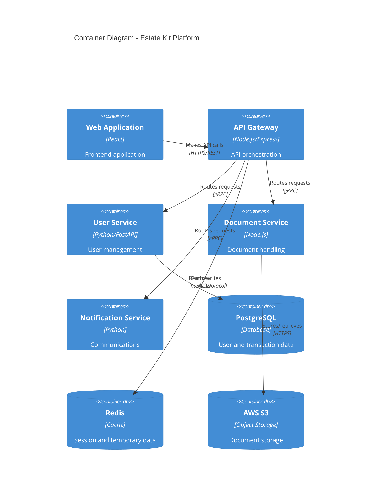
```mermaid
C4Container
    title Container Diagram - Estate Kit Platform

    Container(web, "Web Application", "React", "Frontend application")
    Container(api, "API Gateway", "Node.js/Express", "API orchestration")
    Container(userService, "User Service", "Python/FastAPI", "User management")
    Container(docService, "Document Service", "Node.js", "Document handling")
    Container(notifyService, "Notification Service", "Python", "Communications")
    
    ContainerDb(postgres, "PostgreSQL", "Database", "User and transaction data")
    ContainerDb(redis, "Redis", "Cache", "Session and temporary data")
    ContainerDb(s3, "AWS S3", "Object Storage", "Document storage")

    Rel(web, api, "Makes API calls", "HTTPS/REST")
    Rel(api, userService, "Routes requests", "gRPC")
    Rel(api, docService, "Routes requests", "gRPC")
    Rel(api, notifyService, "Routes requests", "gRPC")
    
    Rel(userService, postgres, "Reads/writes", "SQL")
    Rel(docService, s3, "Stores/retrieves", "HTTPS")
    Rel(api, redis, "Caches", "Redis Protocol")
```

## 2.3 Component Details

### Frontend Application (React)
- **Purpose**: Deliver user interface and handle client-side logic
- **Key Technologies**:
  - React 18+
  - Material UI
  - Redux for state management
  - React Query for API data fetching
- **Scaling**: Deployed to CDN with edge caching

### API Gateway (Node.js/Express)
- **Purpose**: Route and authenticate API requests
- **Key Features**:
  - Request validation
  - Rate limiting
  - API versioning
  - Response caching
- **Scaling**: Horizontal scaling behind load balancer

### Microservices
| Service | Technology | Purpose | Data Store | Scaling Strategy |
|---------|------------|---------|------------|------------------|
| User Service | Python/FastAPI | User management, authentication | PostgreSQL | Horizontal with read replicas |
| Document Service | Node.js | Document processing, storage | AWS S3 | Horizontal with queue-based processing |
| Notification Service | Python | Email/SMS communications | Redis Queue | Event-driven auto-scaling |

## 2.4 Data Flow Architecture

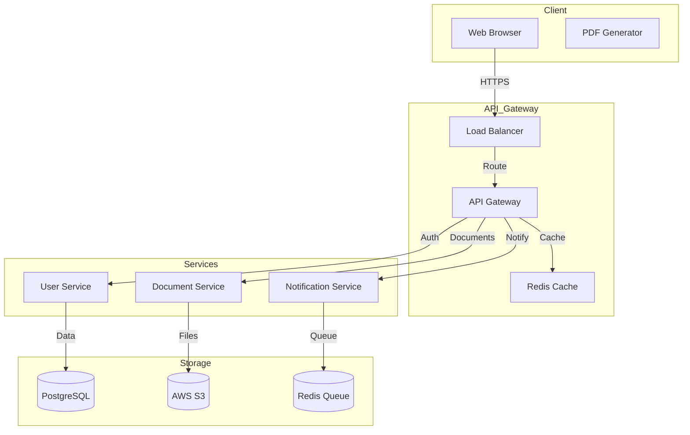
```mermaid
flowchart TD
    subgraph Client
        A[Web Browser]
        B[PDF Generator]
    end

    subgraph API_Gateway
        C[Load Balancer]
        D[API Gateway]
        E[Redis Cache]
    end

    subgraph Services
        F[User Service]
        G[Document Service]
        H[Notification Service]
    end

    subgraph Storage
        I[(PostgreSQL)]
        J[(AWS S3)]
        K[(Redis Queue)]
    end

    A -->|HTTPS| C
    C -->|Route| D
    D -->|Cache| E
    D -->|Auth| F
    D -->|Documents| G
    D -->|Notify| H
    
    F -->|Data| I
    G -->|Files| J
    H -->|Queue| K
```

## 2.5 Deployment Architecture

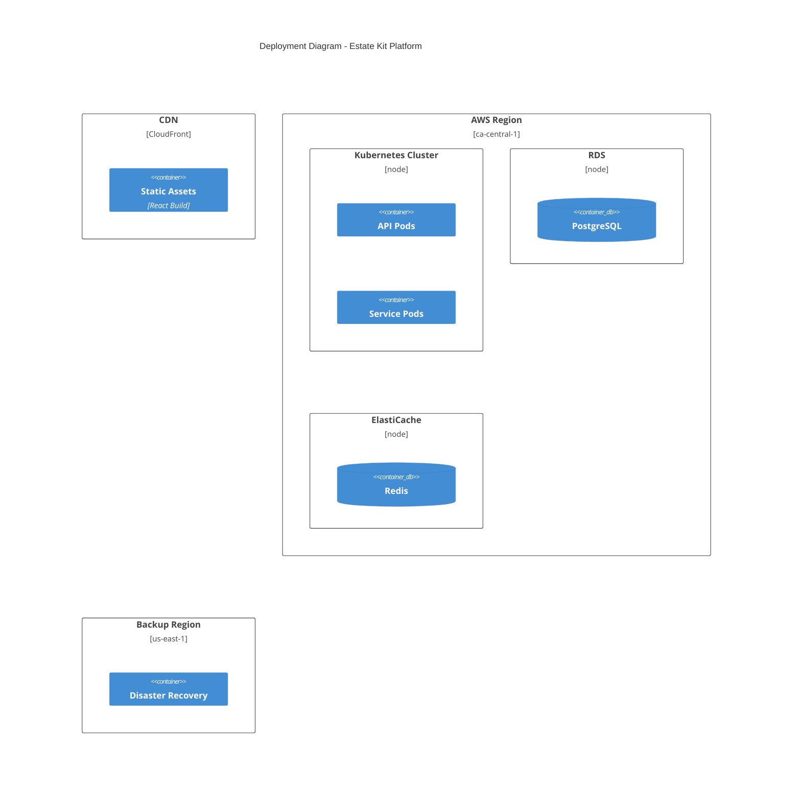
```mermaid
C4Deployment
    title Deployment Diagram - Estate Kit Platform

    Deployment_Node(cdn, "CDN", "CloudFront") {
        Container(static, "Static Assets", "React Build")
    }

    Deployment_Node(aws, "AWS Region", "ca-central-1") {
        Deployment_Node(eks, "Kubernetes Cluster") {
            Container(api, "API Pods")
            Container(services, "Service Pods")
        }
        
        Deployment_Node(rds, "RDS") {
            ContainerDb(db, "PostgreSQL")
        }
        
        Deployment_Node(cache, "ElastiCache") {
            ContainerDb(redis, "Redis")
        }
    }

    Deployment_Node(backup, "Backup Region", "us-east-1") {
        Container(dr, "Disaster Recovery")
    }
```

## 2.6 Technical Decisions

### Architecture Style
- **Microservices Architecture**
  - Enables independent scaling and deployment
  - Allows technology flexibility per service
  - Facilitates team autonomy and parallel development

### Communication Patterns
| Pattern | Usage | Implementation |
|---------|--------|---------------|
| Synchronous | User requests | REST/gRPC |
| Asynchronous | Background tasks | Message queues |
| Event-driven | Notifications | Redis pub/sub |

### Data Storage
| Data Type | Solution | Justification |
|-----------|----------|---------------|
| User data | PostgreSQL | ACID compliance, relational integrity |
| Documents | AWS S3 | Scalable, cost-effective object storage |
| Sessions | Redis | Fast in-memory access, TTL support |

## 2.7 Cross-Cutting Concerns

### Monitoring & Observability
- **Tools**:
  - AWS CloudWatch for metrics
  - ELK Stack for log aggregation
  - Jaeger for distributed tracing
  - Prometheus for service metrics

### Security Architecture
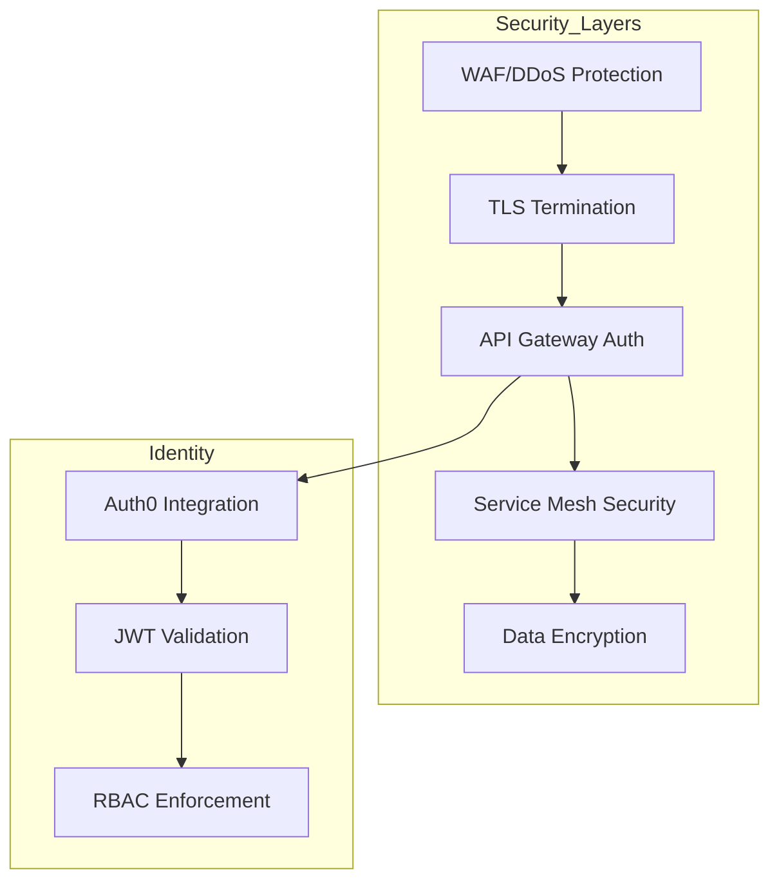
```mermaid
flowchart TD
    subgraph Security_Layers
        A[WAF/DDoS Protection]
        B[TLS Termination]
        C[API Gateway Auth]
        D[Service Mesh Security]
        E[Data Encryption]
    end

    subgraph Identity
        F[Auth0 Integration]
        G[JWT Validation]
        H[RBAC Enforcement]
    end

    A --> B --> C --> D --> E
    C --> F --> G --> H
```

### Disaster Recovery
| Component | RPO | RTO | Strategy |
|-----------|-----|-----|-----------|
| Database | 15 min | 4 hours | Multi-AZ with cross-region replication |
| Documents | 24 hours | 1 hour | S3 cross-region replication |
| Application | 24 hours | 30 min | Multi-region deployment capability |

# 3. SYSTEM COMPONENTS ARCHITECTURE

## 3.1 USER INTERFACE DESIGN

### Design System Specifications

| Component | Specification | Implementation |
|-----------|--------------|----------------|
| Typography | - Base: Inter 16px<br>- Headers: Merriweather<br>- Scale: 1.2 modular | Material UI theme customization |
| Color Palette | - Primary: #2C5282<br>- Secondary: #48BB78<br>- Error: #E53E3E<br>- Neutral: #718096 | CSS custom properties |
| Spacing | 8px base unit with 4x scale | Material UI spacing system |
| Breakpoints | - Mobile: 320px<br>- Tablet: 768px<br>- Desktop: 1024px<br>- Wide: 1440px | CSS media queries |
| Accessibility | WCAG 2.1 Level AA | aria-labels, semantic HTML |

### Component Library Structure

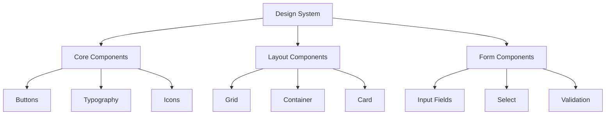
```mermaid
graph TD
    A[Design System] --> B[Core Components]
    A --> C[Layout Components]
    A --> D[Form Components]
    
    B --> B1[Buttons]
    B --> B2[Typography]
    B --> B3[Icons]
    
    C --> C1[Grid]
    C --> C2[Container]
    C --> C3[Card]
    
    D --> D1[Input Fields]
    D --> D2[Select]
    D --> D3[Validation]
```

### Critical User Flows

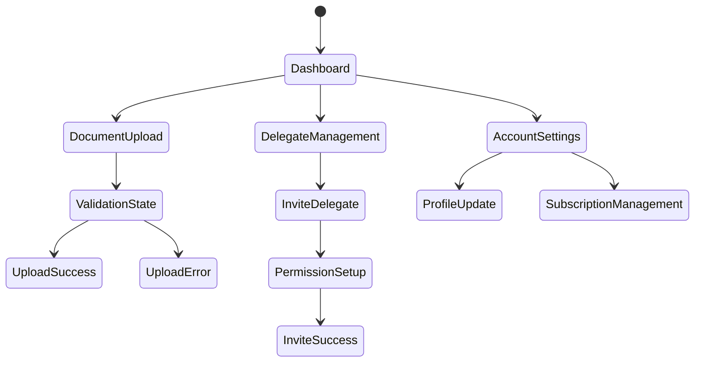
```mermaid
stateDiagram-v2
    [*] --> Dashboard
    Dashboard --> DocumentUpload
    Dashboard --> DelegateManagement
    Dashboard --> AccountSettings
    
    DocumentUpload --> ValidationState
    ValidationState --> UploadSuccess
    ValidationState --> UploadError
    
    DelegateManagement --> InviteDelegate
    InviteDelegate --> PermissionSetup
    PermissionSetup --> InviteSuccess
    
    AccountSettings --> ProfileUpdate
    AccountSettings --> SubscriptionManagement
```

## 3.2 DATABASE DESIGN

### Data Model

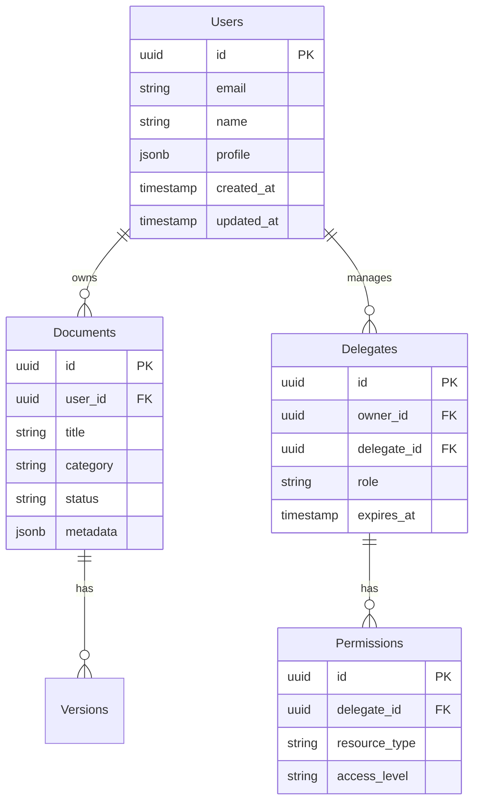
```mermaid
erDiagram
    Users ||--o{ Documents : owns
    Users ||--o{ Delegates : manages
    Users {
        uuid id PK
        string email
        string name
        jsonb profile
        timestamp created_at
        timestamp updated_at
    }
    Documents ||--o{ Versions : has
    Documents {
        uuid id PK
        uuid user_id FK
        string title
        string category
        string status
        jsonb metadata
    }
    Delegates ||--o{ Permissions : has
    Delegates {
        uuid id PK
        uuid owner_id FK
        uuid delegate_id FK
        string role
        timestamp expires_at
    }
    Permissions {
        uuid id PK
        uuid delegate_id FK
        string resource_type
        string access_level
    }
```

### Database Configuration

| Aspect | Implementation | Details |
|--------|----------------|----------|
| Primary Database | PostgreSQL 14+ | Multi-AZ deployment |
| Caching Layer | Redis 6+ | Session and query cache |
| Backup Strategy | Continuous WAL | 15-minute RPO |
| Encryption | AES-256 | At rest and in transit |
| Partitioning | Date-based | Documents and audit logs |
| Indexing | B-tree & GiST | Optimized for search patterns |

### Performance Optimization

| Strategy | Implementation | Purpose |
|----------|----------------|----------|
| Query Caching | Redis with 1-hour TTL | Reduce database load |
| Connection Pooling | pgBouncer | Connection management |
| Materialized Views | Daily refresh | Report optimization |
| Vacuum Strategy | Automated daily | Database maintenance |
| Read Replicas | Cross-region | Load distribution |

## 3.3 API DESIGN

### API Architecture

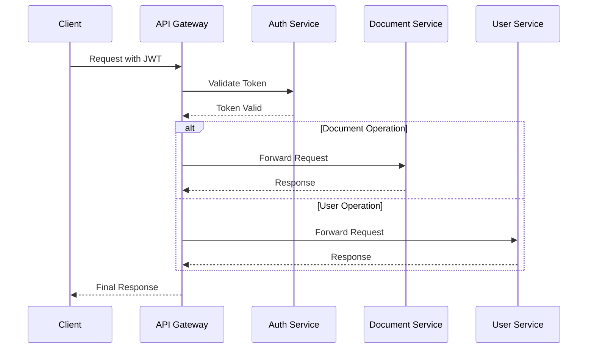
```mermaid
sequenceDiagram
    participant C as Client
    participant G as API Gateway
    participant A as Auth Service
    participant D as Document Service
    participant U as User Service
    
    C->>G: Request with JWT
    G->>A: Validate Token
    A-->>G: Token Valid
    
    alt Document Operation
        G->>D: Forward Request
        D-->>G: Response
    else User Operation
        G->>U: Forward Request
        U-->>G: Response
    end
    
    G-->>C: Final Response
```

### API Specifications

| Category | Specification | Implementation |
|----------|---------------|----------------|
| Protocol | REST over HTTPS | OpenAPI 3.0 |
| Authentication | JWT via Auth0 | RS256 signing |
| Rate Limiting | 1000 req/min | Token bucket algorithm |
| Versioning | URI-based (/v1/) | Semantic versioning |
| Documentation | OpenAPI/Swagger | Auto-generated docs |
| Response Format | JSON/HAL | Hypermedia controls |

### Endpoint Structure

| Endpoint | Method | Purpose | Authentication |
|----------|---------|---------|----------------|
| /v1/documents | GET, POST | Document management | Required |
| /v1/delegates | GET, POST, DELETE | Delegate management | Required |
| /v1/users | GET, PATCH | User profile management | Required |
| /v1/auth | POST | Authentication | Public |
| /v1/subscriptions | GET, POST, PUT | Subscription management | Required |

### Integration Patterns

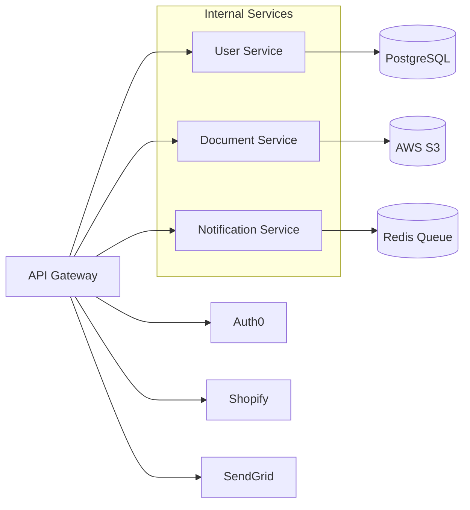
```mermaid
flowchart LR
    A[API Gateway] --> B[Auth0]
    A --> C[Shopify]
    A --> D[SendGrid]
    
    subgraph Internal Services
        E[User Service]
        F[Document Service]
        G[Notification Service]
    end
    
    A --> E
    A --> F
    A --> G
    
    E --> H[(PostgreSQL)]
    F --> I[(AWS S3)]
    G --> J[(Redis Queue)]
```

# 4. TECHNOLOGY STACK

## 4.1 PROGRAMMING LANGUAGES

| Platform/Component | Language | Version | Justification |
|-------------------|----------|---------|---------------|
| Frontend | TypeScript | 4.9+ | - Strong typing for large-scale application<br>- Enhanced IDE support<br>- Better maintainability |
| Primary Backend | Python | 3.11+ | - Robust standard library<br>- Excellent data processing capabilities<br>- Strong security features |
| Document Service | Node.js | 18 LTS | - Efficient document processing<br>- Native async handling<br>- Strong streaming capabilities |
| Build Tools | JavaScript | ES2022 | - Native build tool support<br>- Webpack/Babel compatibility<br>- NPM ecosystem |

## 4.2 FRAMEWORKS & LIBRARIES

### Frontend Framework Stack

| Component | Technology | Version | Purpose |
|-----------|------------|---------|----------|
| Core Framework | React | 18.2+ | - Component-based architecture<br>- Virtual DOM for performance<br>- Large ecosystem |
| UI Framework | Material UI | 5.11+ | - Accessibility compliance<br>- Senior-friendly components<br>- Responsive design |
| State Management | Redux Toolkit | 1.9+ | - Predictable state updates<br>- DevTools integration<br>- Middleware support |
| API Integration | React Query | 4.0+ | - Efficient data fetching<br>- Cache management<br>- Real-time updates |

### Backend Framework Stack

| Component | Technology | Version | Purpose |
|-----------|------------|---------|----------|
| API Gateway | Express.js | 4.18+ | - Route management<br>- Middleware support<br>- Load balancing |
| User Service | FastAPI | 0.95+ | - High performance<br>- Automatic OpenAPI docs<br>- Type validation |
| Document Service | Node.js Express | 4.18+ | - Stream processing<br>- S3 integration<br>- PDF generation |
| Task Queue | Celery | 5.2+ | - Async task processing<br>- Scheduled jobs<br>- Worker management |

## 4.3 DATABASES & STORAGE

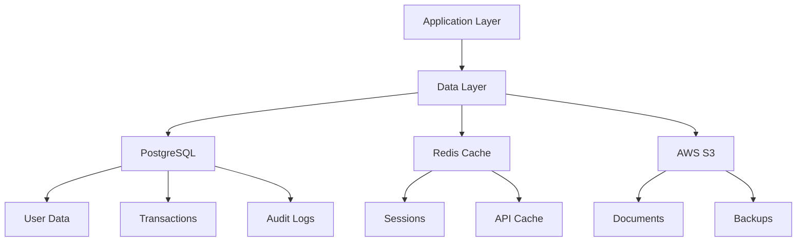
```mermaid
flowchart TD
    A[Application Layer] --> B[Data Layer]
    B --> C[PostgreSQL]
    B --> D[Redis Cache]
    B --> E[AWS S3]
    
    C --> F[User Data]
    C --> G[Transactions]
    C --> H[Audit Logs]
    
    D --> I[Sessions]
    D --> J[API Cache]
    
    E --> K[Documents]
    E --> L[Backups]
```

| Component | Technology | Version | Configuration |
|-----------|------------|---------|---------------|
| Primary Database | PostgreSQL | 14+ | - Multi-AZ deployment<br>- Read replicas<br>- Point-in-time recovery |
| Cache Layer | Redis | 6.2+ | - Cluster mode<br>- In-memory cache<br>- Session storage |
| Document Storage | AWS S3 | Latest | - Server-side encryption<br>- Versioning enabled<br>- Lifecycle policies |
| Search Engine | Elasticsearch | 8.0+ | - Document indexing<br>- Full-text search<br>- Analytics |

## 4.4 THIRD-PARTY SERVICES

| Service | Purpose | Integration Method |
|---------|---------|-------------------|
| Auth0 | Authentication | - OAuth 2.0/OIDC<br>- JWT tokens<br>- SSO support |
| Shopify | E-commerce | - REST API<br>- Webhooks<br>- Admin API |
| SendGrid | Communications | - SMTP relay<br>- REST API<br>- Event webhooks |
| Intercom | Customer Support | - JavaScript SDK<br>- REST API<br>- Messenger integration |
| Sanity.io | Content Management | - GraphQL API<br>- GROQ queries<br>- Real-time updates |

## 4.5 DEVELOPMENT & DEPLOYMENT

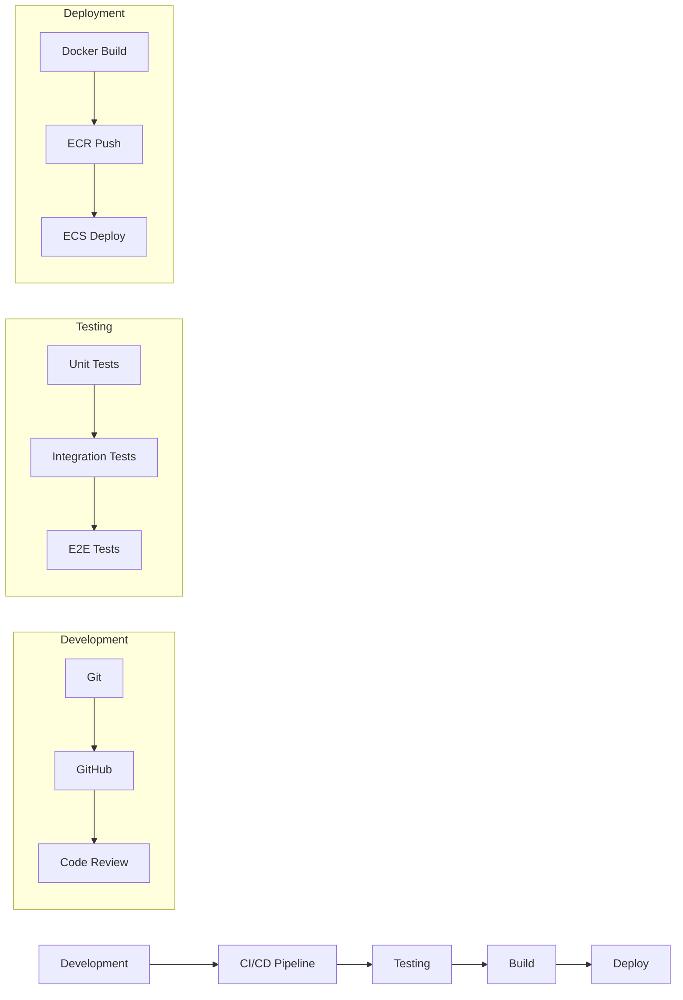
```mermaid
flowchart LR
    A[Development] --> B[CI/CD Pipeline]
    B --> C[Testing]
    C --> D[Build]
    D --> E[Deploy]
    
    subgraph Development
    F[Git] --> G[GitHub]
    G --> H[Code Review]
    end
    
    subgraph Testing
    I[Unit Tests] --> J[Integration Tests]
    J --> K[E2E Tests]
    end
    
    subgraph Deployment
    L[Docker Build] --> M[ECR Push]
    M --> N[ECS Deploy]
    end
```

### Development Tools

| Category | Tool | Version | Purpose |
|----------|------|---------|----------|
| IDE | VS Code | Latest | - TypeScript support<br>- Debug tools<br>- Extension ecosystem |
| Version Control | Git | 2.40+ | - Branch management<br>- Code review<br>- Change tracking |
| Package Management | npm/pip | Latest | - Dependency management<br>- Script automation<br>- Version control |
| Testing | Jest/Pytest | Latest | - Unit testing<br>- Integration testing<br>- Coverage reporting |

### Deployment Pipeline

| Stage | Technology | Configuration |
|-------|------------|---------------|
| Containerization | Docker | - Multi-stage builds<br>- Layer caching<br>- Security scanning |
| Container Registry | AWS ECR | - Image versioning<br>- Vulnerability scanning<br>- Access control |
| Orchestration | AWS ECS | - Auto-scaling<br>- Load balancing<br>- Service discovery |
| CI/CD | GitHub Actions | - Automated testing<br>- Deployment automation<br>- Environment management |

# 5. SYSTEM DESIGN

## 5.1 USER INTERFACE DESIGN

### Core Layout Structure

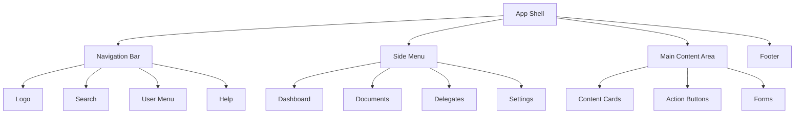
```mermaid
flowchart TD
    A[App Shell] --> B[Navigation Bar]
    A --> C[Side Menu]
    A --> D[Main Content Area]
    A --> E[Footer]
    
    B --> B1[Logo]
    B --> B2[Search]
    B --> B3[User Menu]
    B --> B4[Help]
    
    C --> C1[Dashboard]
    C --> C2[Documents]
    C --> C3[Delegates]
    C --> C4[Settings]
    
    D --> D1[Content Cards]
    D --> D2[Action Buttons]
    D --> D3[Forms]
```

### Key Interface Components

| Component | Description | Accessibility Features |
|-----------|-------------|----------------------|
| Navigation | Fixed top bar with responsive menu | - High contrast colors<br>- Keyboard navigation<br>- ARIA landmarks |
| Document Upload | Drag-and-drop with fallback | - Screen reader support<br>- Progress indicators<br>- Error handling |
| Form Fields | Material UI components | - Label association<br>- Validation feedback<br>- Focus management |
| Delegate Management | Permission matrix interface | - Clear role indicators<br>- Tabbed navigation<br>- Status feedback |

### Responsive Breakpoints

| Breakpoint | Width | Layout Adjustments |
|------------|-------|-------------------|
| Mobile | < 768px | - Stack navigation<br>- Full-width forms<br>- Hidden side menu |
| Tablet | 768px - 1024px | - Condensed navigation<br>- Two-column layout<br>- Collapsible side menu |
| Desktop | > 1024px | - Expanded navigation<br>- Three-column layout<br>- Persistent side menu |

## 5.2 DATABASE DESIGN

### Core Data Model

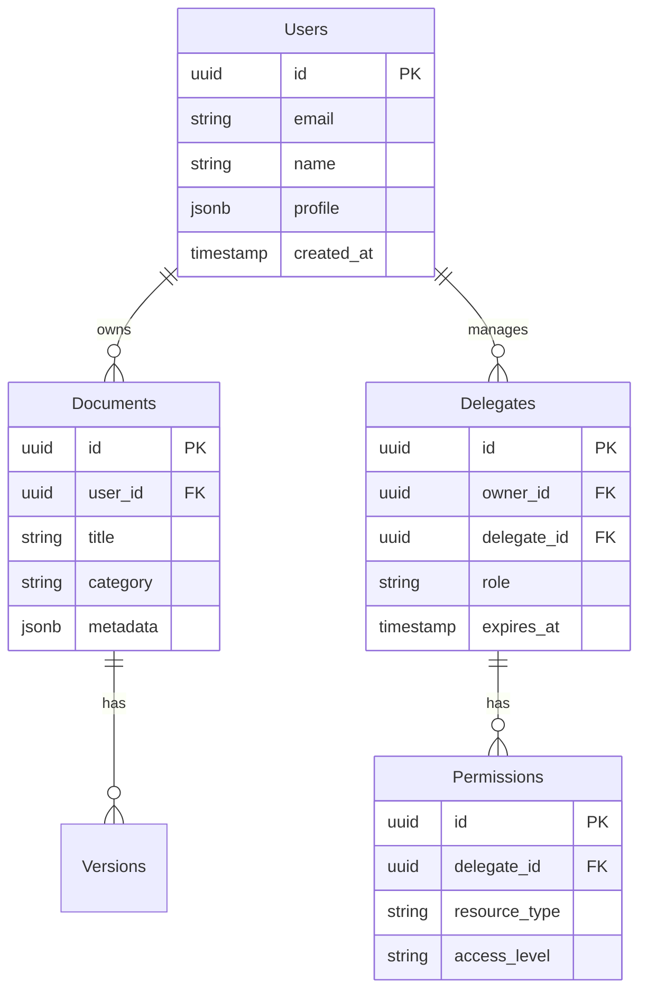
```mermaid
erDiagram
    Users ||--o{ Documents : owns
    Users ||--o{ Delegates : manages
    Users {
        uuid id PK
        string email
        string name
        jsonb profile
        timestamp created_at
    }
    Documents ||--o{ Versions : has
    Documents {
        uuid id PK
        uuid user_id FK
        string title
        string category
        jsonb metadata
    }
    Delegates ||--o{ Permissions : has
    Delegates {
        uuid id PK
        uuid owner_id FK
        uuid delegate_id FK
        string role
        timestamp expires_at
    }
    Permissions {
        uuid id PK
        uuid delegate_id FK
        string resource_type
        string access_level
    }
```

### Storage Configuration

| Store Type | Technology | Purpose | Configuration |
|------------|------------|---------|---------------|
| Primary DB | PostgreSQL | User and relationship data | - Multi-AZ deployment<br>- Read replicas<br>- WAL archiving |
| Document Store | AWS S3 | File storage | - Server-side encryption<br>- Versioning enabled<br>- Lifecycle policies |
| Cache Layer | Redis | Session and query cache | - Cluster mode<br>- Persistence enabled<br>- Eviction policies |

### Data Access Patterns

| Operation | Access Pattern | Optimization |
|-----------|---------------|--------------|
| Document Retrieval | Read-heavy | - Materialized views<br>- Redis caching<br>- S3 CDN |
| User Authentication | High-frequency reads | - Connection pooling<br>- Index optimization<br>- Cache warming |
| Document Upload | Write-heavy | - Batch processing<br>- Background jobs<br>- Write buffering |

## 5.3 API DESIGN

### API Architecture

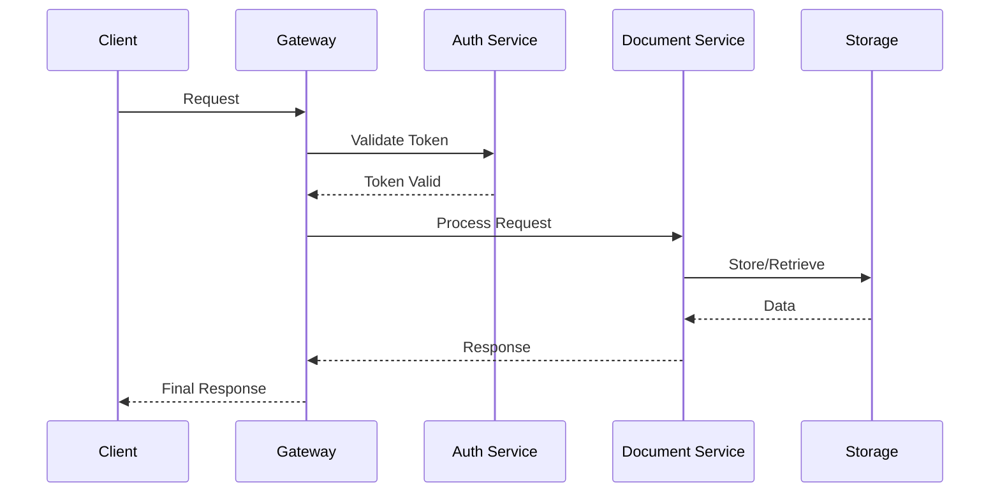
```mermaid
sequenceDiagram
    participant C as Client
    participant G as Gateway
    participant A as Auth Service
    participant D as Document Service
    participant S as Storage
    
    C->>G: Request
    G->>A: Validate Token
    A-->>G: Token Valid
    G->>D: Process Request
    D->>S: Store/Retrieve
    S-->>D: Data
    D-->>G: Response
    G-->>C: Final Response
```

### API Endpoints

| Endpoint | Method | Purpose | Authentication |
|----------|---------|---------|----------------|
| /api/v1/documents | GET, POST | Document management | Required |
| /api/v1/delegates | GET, POST, DELETE | Delegate management | Required |
| /api/v1/users | GET, PATCH | User profile management | Required |
| /api/v1/auth | POST | Authentication | Public |

### Integration Interfaces

| Service | Integration Type | Implementation |
|---------|-----------------|----------------|
| Auth0 | OAuth 2.0/OIDC | - JWT validation<br>- Role mapping<br>- SSO support |
| Shopify | REST/Webhooks | - Order processing<br>- Subscription management<br>- Inventory sync |
| SendGrid | REST API | - Email templates<br>- Event tracking<br>- Delivery monitoring |
| Intercom | JavaScript SDK | - Chat widget<br>- User tracking<br>- Support tickets |

### API Security

| Layer | Implementation | Purpose |
|-------|---------------|---------|
| Authentication | JWT tokens | Request validation |
| Authorization | RBAC | Access control |
| Rate Limiting | Token bucket | Abuse prevention |
| Encryption | TLS 1.3 | Data protection |
| Monitoring | OpenTelemetry | Performance tracking |

# 6. USER INTERFACE DESIGN

## 6.1 Common Components

### Navigation Header
```
+--------------------------------------------------------------------------------+
| [#] Estate Kit    [@]Profile  [?]Help  [=]Settings                              |
+--------------------------------------------------------------------------------+
| Dashboard > Documents > Upload                                                   |
+--------------------------------------------------------------------------------+
```

### Side Navigation
```
+------------------------+
| [#] Dashboard          |
| [^] Documents          |
| [@] Delegates         |
| [$] Subscription      |
| [=] Settings          |
| [?] Help & Support    |
+------------------------+
```

## 6.2 Main Dashboard
```
+--------------------------------------------------------------------------------+
| Welcome back, John Smith                                     [!] 2 Tasks Pending |
+--------------------------------------------------------------------------------+
|                                                                                 |
| +------------------+  +-------------------+  +----------------------+            |
| | Documents        |  | Delegates         |  | Subscription Status  |            |
| |                  |  |                   |  |                      |            |
| | 15 Total         |  | 2 Active          |  | Premium Plan         |            |
| | [====75%====]    |  | 1 Pending         |  | Renews: 2024-03-01  |            |
| | [Upload Now]     |  | [Manage]          |  | [$][Manage Plan]     |            |
| +------------------+  +-------------------+  +----------------------+            |
|                                                                                 |
| Recent Activity                                                                 |
| +------------------------------------------------------------------------+    |
| | [i] Medical directive uploaded by Dr. Smith          2024-02-15 14:30    |    |
| | [i] New delegate invitation sent to lawyer@firm.com   2024-02-14 09:15    |    |
| | [i] Updated banking information                      2024-02-13 16:45    |    |
| +------------------------------------------------------------------------+    |
+--------------------------------------------------------------------------------+
```

## 6.3 Document Upload Interface
```
+--------------------------------------------------------------------------------+
| Upload Documents                                              [?] Upload Guide   |
+--------------------------------------------------------------------------------+
| Document Type: [v] Medical Records                                              |
|                                                                                 |
| +------------------------------------------------------------------------+    |
| |                                                                          |    |
| |  [^] Drag and drop files here or click to browse                        |    |
| |                                                                          |    |
| +------------------------------------------------------------------------+    |
|                                                                                 |
| Selected Files:                                                                 |
| +------------------------------------------------------------------------+    |
| | [x] medical_report_2024.pdf                                    [====100%]|    |
| | [x] lab_results.pdf                                            [====100%]|    |
| | [x] prescription_list.pdf                                      [==50%==] |    |
| +------------------------------------------------------------------------+    |
|                                                                                 |
| [Cancel]                                                           [Upload All] |
+--------------------------------------------------------------------------------+
```

## 6.4 Delegate Management
```
+--------------------------------------------------------------------------------+
| Manage Delegates                                    [+] Add New Delegate         |
+--------------------------------------------------------------------------------+
| Active Delegates:                                                               |
| +------------------------------------------------------------------------+    |
| | [@] Sarah Johnson - Executor                                             |    |
| | +-- [x] Financial Documents     [x] Legal Documents    [x] Medical Info  |    |
| | +-- Last Access: 2024-02-14    Status: Active         [Modify] [Remove] |    |
| |                                                                          |    |
| | [@] Dr. Smith - Healthcare Proxy                                         |    |
| | +-- [ ] Financial Documents     [ ] Legal Documents    [x] Medical Info  |    |
| | +-- Last Access: 2024-02-10    Status: Active         [Modify] [Remove] |    |
| +------------------------------------------------------------------------+    |
|                                                                                 |
| Pending Invitations:                                                           |
| +------------------------------------------------------------------------+    |
| | [@] lawyer@firm.com - Legal Advisor                                      |    |
| | +-- Sent: 2024-02-14           Status: Pending        [Cancel Invite]    |    |
| +------------------------------------------------------------------------+    |
+--------------------------------------------------------------------------------+
```

## 6.5 Settings Interface
```
+--------------------------------------------------------------------------------+
| Account Settings                                                                |
+--------------------------------------------------------------------------------+
| Personal Information:                                                           |
| +------------------------------------------------------------------------+    |
| | Name:     [...........................] John Smith                       |    |
| | Email:    [...........................] john.smith@email.com            |    |
| | Phone:    [...........................] (555) 123-4567                  |    |
| | Province: [v] Ontario                                                    |    |
| +------------------------------------------------------------------------+    |
|                                                                                 |
| Security Settings:                                                             |
| +------------------------------------------------------------------------+    |
| | [x] Enable Two-Factor Authentication                                     |    |
| | [x] Email notifications for delegate access                              |    |
| | [ ] SMS notifications for document uploads                               |    |
| +------------------------------------------------------------------------+    |
|                                                                                 |
| [Cancel]                                                           [Save Changes]
+--------------------------------------------------------------------------------+
```

## 6.6 Symbol Key

| Symbol | Meaning |
|--------|---------|
| [#] | Dashboard/Menu icon |
| [@] | User/Profile icon |
| [?] | Help/Information |
| [=] | Settings |
| [^] | Upload |
| [$] | Financial/Payment |
| [!] | Alert/Warning |
| [x] | Close/Remove |
| [+] | Add New |
| [v] | Dropdown Menu |
| [...] | Text Input Field |
| [====] | Progress Bar |
| ( ) | Radio Button |
| [ ] | Checkbox |

## 6.7 Responsive Behavior

```
Mobile View (< 768px)
+------------------------+
| [=] Estate Kit    [@]  |
+------------------------+
| [Menu Items Collapsed] |
+------------------------+
| Content Area           |
| (Single Column)        |
|                        |
| +------------------+   |
| | Card 1           |   |
| +------------------+   |
|                        |
| +------------------+   |
| | Card 2           |   |
| +------------------+   |
+------------------------+

Tablet View (768px - 1024px)
+--------------------------------+
| [=] Estate Kit           [@]    |
+--------------------------------+
| [Side Nav]  | Content Area      |
| Collapsible | (Two Columns)     |
|             |                   |
|             | +----+  +----+    |
|             | |Card|  |Card|    |
|             | +----+  +----+    |
+--------------------------------+

Desktop View (> 1024px)
+------------------------------------------------+
| [=] Estate Kit                            [@]    |
+------------------------------------------------+
| [Side Nav]  | Content Area                       |
| Persistent  | (Three Columns)                    |
|             |                                    |
|             | +----+  +----+  +----+            |
|             | |Card|  |Card|  |Card|            |
|             | +----+  +----+  +----+            |
+------------------------------------------------+
```

# 7. SECURITY CONSIDERATIONS

## 7.1 AUTHENTICATION AND AUTHORIZATION

### Authentication Flow

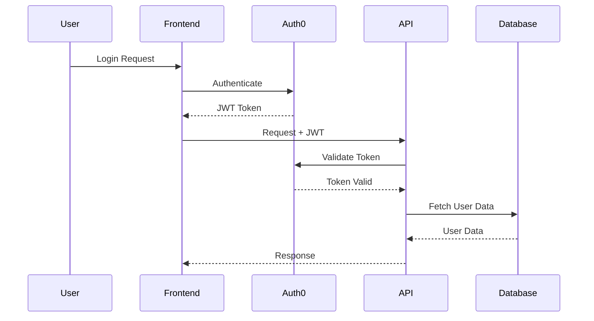
```mermaid
sequenceDiagram
    participant User
    participant Frontend
    participant Auth0
    participant API
    participant Database

    User->>Frontend: Login Request
    Frontend->>Auth0: Authenticate
    Auth0-->>Frontend: JWT Token
    Frontend->>API: Request + JWT
    API->>Auth0: Validate Token
    Auth0-->>API: Token Valid
    API->>Database: Fetch User Data
    Database-->>API: User Data
    API-->>Frontend: Response
```

### Authorization Matrix

| Role | Personal Info | Financial Data | Medical Data | Legal Docs | Delegate Management |
|------|--------------|----------------|--------------|------------|-------------------|
| Owner | Full Access | Full Access | Full Access | Full Access | Full Access |
| Executor | Read | Read | No Access | Read | No Access |
| Healthcare Proxy | Read | No Access | Read | Read (Limited) | No Access |
| Financial Advisor | No Access | Read | No Access | No Access | No Access |
| Legal Advisor | Read | Read (Limited) | No Access | Read | No Access |

### Authentication Implementation

| Component | Implementation | Details |
|-----------|----------------|----------|
| Identity Provider | Auth0 | - OpenID Connect/OAuth 2.0<br>- MFA support<br>- Password policies<br>- Social login options |
| Session Management | JWT + Redis | - 30-minute token expiry<br>- Refresh token rotation<br>- Secure cookie handling |
| Access Control | RBAC | - Role-based permissions<br>- Resource-level access<br>- Temporal access controls |

## 7.2 DATA SECURITY

### Encryption Architecture

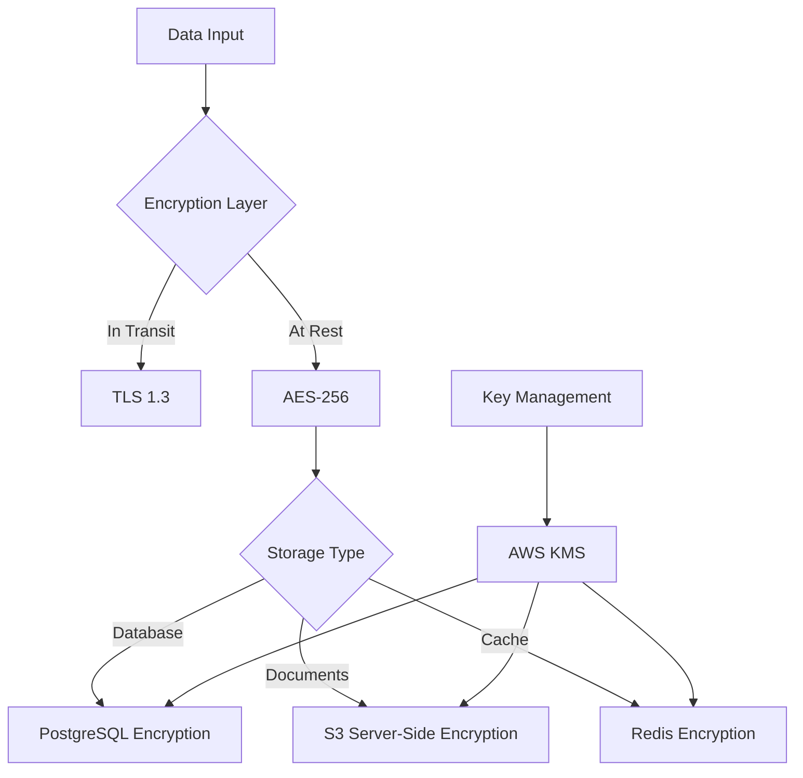
```mermaid
flowchart TD
    A[Data Input] --> B{Encryption Layer}
    B -->|In Transit| C[TLS 1.3]
    B -->|At Rest| D[AES-256]
    
    D --> E{Storage Type}
    E -->|Database| F[PostgreSQL Encryption]
    E -->|Documents| G[S3 Server-Side Encryption]
    E -->|Cache| H[Redis Encryption]
    
    I[Key Management] --> J[AWS KMS]
    J --> F
    J --> G
    J --> H
```

### Data Protection Measures

| Data Type | Protection Method | Implementation |
|-----------|------------------|----------------|
| Personal Information | Field-level Encryption | - AES-256 encryption<br>- Secure key rotation<br>- Data masking |
| Documents | Server-side Encryption | - S3 encryption<br>- Versioning enabled<br>- Access logging |
| Credentials | Salted Hashing | - Bcrypt algorithm<br>- Minimum 12 rounds<br>- Secure storage |
| Session Data | Encrypted Cache | - Redis encryption<br>- Memory protection<br>- Auto-expiration |

## 7.3 SECURITY PROTOCOLS

### Security Monitoring

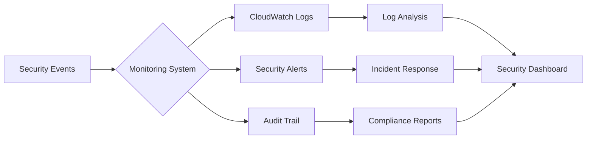
```mermaid
flowchart LR
    A[Security Events] --> B{Monitoring System}
    B --> C[CloudWatch Logs]
    B --> D[Security Alerts]
    B --> E[Audit Trail]
    
    C --> F[Log Analysis]
    D --> G[Incident Response]
    E --> H[Compliance Reports]
    
    F --> I[Security Dashboard]
    G --> I
    H --> I
```

### Security Standards Compliance

| Standard | Implementation | Validation |
|----------|----------------|------------|
| PIPEDA | - Data privacy controls<br>- Consent management<br>- Access controls | Annual audit |
| HIPAA | - PHI protection<br>- Access logging<br>- Encryption requirements | Quarterly review |
| SOC 2 | - Security controls<br>- Availability measures<br>- Confidentiality controls | Annual certification |

### Security Procedures

| Procedure | Implementation | Frequency |
|-----------|----------------|-----------|
| Vulnerability Scanning | - Automated scans<br>- Dependency checks<br>- Code analysis | Weekly |
| Penetration Testing | - External testing<br>- API security testing<br>- Infrastructure review | Semi-annually |
| Security Updates | - OS patching<br>- Library updates<br>- Security fixes | Monthly |
| Access Review | - User access audit<br>- Permission verification<br>- Inactive account cleanup | Quarterly |

### Incident Response

| Phase | Actions | Responsibility |
|-------|---------|---------------|
| Detection | - Automated monitoring<br>- Alert triggers<br>- User reports | Security Team |
| Analysis | - Threat assessment<br>- Impact evaluation<br>- Root cause analysis | Security + DevOps |
| Containment | - Threat isolation<br>- Access restriction<br>- System protection | DevOps Team |
| Recovery | - System restoration<br>- Data verification<br>- Service resumption | Operations Team |
| Post-Incident | - Incident documentation<br>- Process improvement<br>- Training updates | Security + Management |

# 8. INFRASTRUCTURE

## 8.1 DEPLOYMENT ENVIRONMENT

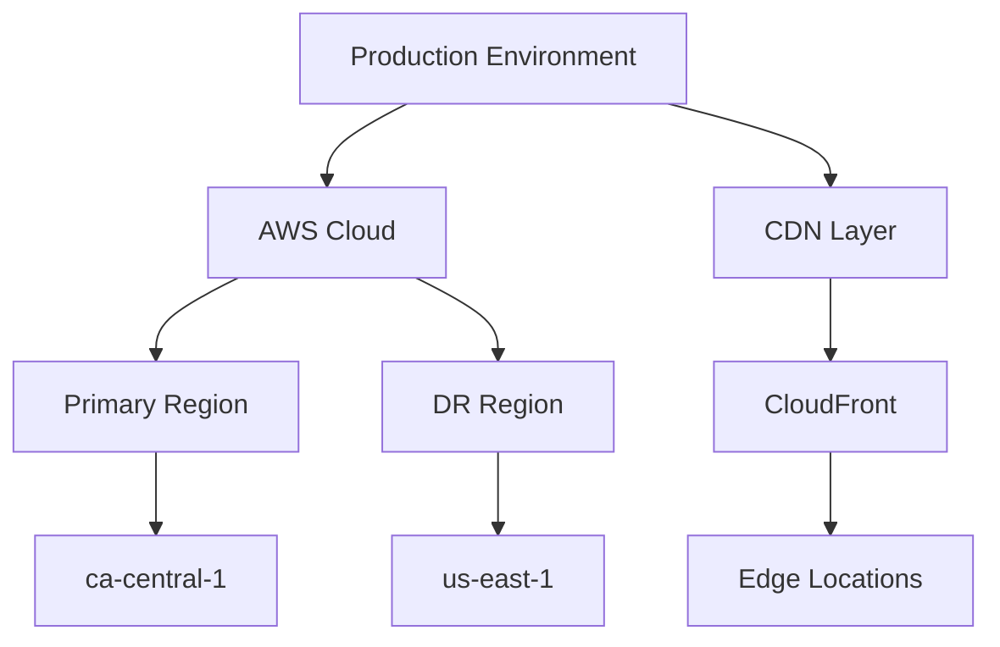
```mermaid
flowchart TD
    A[Production Environment] --> B[AWS Cloud]
    A --> C[CDN Layer]
    
    B --> D[Primary Region]
    B --> E[DR Region]
    
    D --> F[ca-central-1]
    E --> G[us-east-1]
    
    C --> H[CloudFront]
    H --> I[Edge Locations]
```

| Environment | Configuration | Purpose |
|-------------|--------------|----------|
| Production | Multi-AZ in ca-central-1 | Primary production workload |
| Staging | Single-AZ in ca-central-1 | Pre-production testing |
| Development | Single-AZ in ca-central-1 | Development and testing |
| DR | Cross-region in us-east-1 | Disaster recovery |

## 8.2 CLOUD SERVICES

| Service | Usage | Configuration |
|---------|-------|--------------|
| AWS EC2 | Application hosting | - t3.large instances<br>- Auto-scaling groups<br>- Spot instances for non-prod |
| AWS RDS | PostgreSQL database | - db.t3.large<br>- Multi-AZ deployment<br>- Automated backups |
| AWS S3 | Document storage | - Standard storage class<br>- Versioning enabled<br>- Server-side encryption |
| AWS ElastiCache | Redis caching | - cache.t3.medium<br>- Cluster mode disabled<br>- Multi-AZ replication |
| AWS CloudFront | CDN | - Custom domain<br>- Edge locations in Canada<br>- HTTPS enforcement |
| AWS Route53 | DNS management | - Health checks<br>- Failover routing<br>- Latency-based routing |

## 8.3 CONTAINERIZATION

### Container Architecture

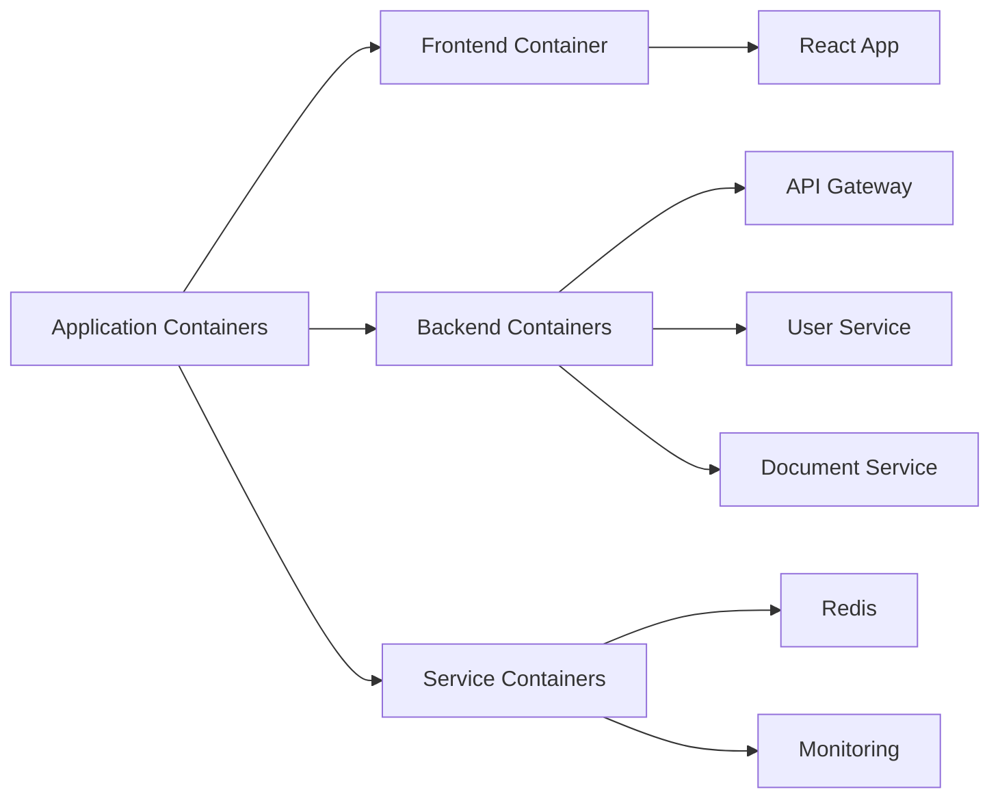
```mermaid
flowchart LR
    A[Application Containers] --> B[Frontend Container]
    A --> C[Backend Containers]
    A --> D[Service Containers]
    
    B --> E[React App]
    
    C --> F[API Gateway]
    C --> G[User Service]
    C --> H[Document Service]
    
    D --> I[Redis]
    D --> J[Monitoring]
```

### Container Specifications

| Container | Base Image | Resources |
|-----------|------------|-----------|
| Frontend | node:18-alpine | - 1 CPU<br>- 2GB RAM |
| API Gateway | node:18-alpine | - 2 CPU<br>- 4GB RAM |
| User Service | python:3.11-slim | - 2 CPU<br>- 4GB RAM |
| Document Service | node:18-alpine | - 2 CPU<br>- 4GB RAM |
| Redis | redis:6.2-alpine | - 1 CPU<br>- 2GB RAM |

## 8.4 ORCHESTRATION

### Kubernetes Architecture

```mermaid
flowchart TD
    A[AWS EKS Cluster] --> B[Node Groups]
    B --> C[Application Nodes]
    B --> D[Service Nodes]
    
    C --> E[Frontend Pods]
    C --> F[Backend Pods]
    
    D --> G[Monitoring Pods]
    D --> H[Cache Pods]
    
    I[Load Balancer] --> E
    I --> F
```

### Cluster Configuration

| Component | Specification | Details |
|-----------|--------------|----------|
| EKS Version | 1.24 | Latest stable release |
| Node Groups | - Application: 3-10 nodes<br>- Service: 2-5 nodes | Auto-scaling enabled |
| Pod Scaling | HorizontalPodAutoscaler | Based on CPU/memory |
| Storage | EBS CSI Driver | Dynamic provisioning |
| Networking | AWS VPC CNI | Native VPC networking |

## 8.5 CI/CD PIPELINE

### Pipeline Architecture

```mermaid
flowchart LR
    A[Source] --> B[Build]
    B --> C[Test]
    C --> D[Security Scan]
    D --> E[Deploy]
    
    subgraph Source
    A1[GitHub]
    end
    
    subgraph Build
    B1[Docker Build]
    end
    
    subgraph Test
    C1[Unit Tests]
    C2[Integration Tests]
    end
    
    subgraph Security
    D1[SAST]
    D2[Container Scan]
    end
    
    subgraph Deploy
    E1[EKS Deploy]
    E2[Config Update]
    end
```

### Pipeline Stages

| Stage | Tools | Configuration |
|-------|-------|--------------|
| Source Control | GitHub | - Protected branches<br>- Required reviews<br>- Status checks |
| Build | GitHub Actions | - Multi-stage builds<br>- Cache layers<br>- Parallel jobs |
| Testing | Jest/Pytest | - Unit tests<br>- Integration tests<br>- Coverage reports |
| Security | Snyk/SonarQube | - Code analysis<br>- Dependency scanning<br>- Container scanning |
| Deployment | ArgoCD | - GitOps workflow<br>- Automated rollbacks<br>- Progressive delivery |

### Deployment Strategy

| Environment | Strategy | Configuration |
|-------------|----------|--------------|
| Development | Direct Deploy | - Automatic deployments<br>- Basic validation |
| Staging | Blue/Green | - Pre-production testing<br>- Full integration tests |
| Production | Canary | - Progressive rollout<br>- Health monitoring<br>- Automated rollback |

# 8. APPENDICES

## 8.1 ADDITIONAL TECHNICAL INFORMATION

### Development Environment Setup

| Component | Tool | Version | Configuration |
|-----------|------|---------|---------------|
| IDE | VS Code | Latest | - ESLint/Prettier integration<br>- GitLens<br>- Docker extension<br>- React/TypeScript plugins |
| Local Development | Docker Compose | Latest | - PostgreSQL container<br>- Redis container<br>- MinIO (S3 compatible)<br>- Mailhog (SMTP testing) |
| API Testing | Postman | Latest | - Environment variables<br>- JWT authentication<br>- Collection scripts |
| Git Workflow | GitHub Flow | N/A | - Protected main branch<br>- PR templates<br>- Branch naming conventions |

### Error Handling Standards

```mermaid
flowchart TD
    A[Error Occurs] --> B{Error Type}
    B -->|Validation| C[400 Bad Request]
    B -->|Authentication| D[401 Unauthorized]
    B -->|Authorization| E[403 Forbidden]
    B -->|Not Found| F[404 Not Found]
    B -->|Server| G[500 Internal Error]
    
    C --> H[Error Response]
    D --> H
    E --> H
    F --> H
    G --> H
    
    H --> I[Error Logging]
    I --> J[CloudWatch]
```

### Monitoring Setup

| Metric Type | Tool | Threshold | Alert Channel |
|------------|------|-----------|---------------|
| Server CPU | CloudWatch | > 70% | PagerDuty |
| Memory Usage | CloudWatch | > 80% | PagerDuty |
| API Latency | Custom Metrics | > 500ms | Slack |
| Error Rate | CloudWatch | > 1% | Email + Slack |
| Disk Usage | CloudWatch | > 85% | Email |

## 8.2 GLOSSARY

| Term | Definition |
|------|------------|
| Access Control List (ACL) | A list of permissions attached to objects in the system |
| Blue/Green Deployment | A deployment strategy using two identical environments for zero-downtime updates |
| Content Delivery Network (CDN) | A distributed network of servers that delivers content based on user location |
| Delegate Access | Controlled permissions granted to executors, healthcare proxies, or other authorized users |
| Digital Vault | Secure cloud storage system for sensitive estate planning documents |
| Estate Kit | Combined physical and digital solution for comprehensive estate planning |
| Headless CMS | Content management system that manages content without a frontend |
| Multi-Factor Authentication (MFA) | Security system requiring multiple forms of verification |
| Role-Based Access Control (RBAC) | Access management based on user roles within the system |
| Server-Side Encryption (SSE) | Data encryption performed by the storage service |

## 8.3 ACRONYMS

| Acronym | Full Form |
|---------|-----------|
| AES | Advanced Encryption Standard |
| API | Application Programming Interface |
| AWS | Amazon Web Services |
| CDN | Content Delivery Network |
| CI/CD | Continuous Integration/Continuous Deployment |
| CMS | Content Management System |
| CPU | Central Processing Unit |
| DNS | Domain Name System |
| EBS | Elastic Block Store |
| EC2 | Elastic Compute Cloud |
| ECS | Elastic Container Service |
| EKS | Elastic Kubernetes Service |
| GDPR | General Data Protection Regulation |
| HIPAA | Health Insurance Portability and Accountability Act |
| HTML | HyperText Markup Language |
| HTTP | HyperText Transfer Protocol |
| HTTPS | HyperText Transfer Protocol Secure |
| IAM | Identity and Access Management |
| IDE | Integrated Development Environment |
| JWT | JSON Web Token |
| KMS | Key Management Service |
| MFA | Multi-Factor Authentication |
| OIDC | OpenID Connect |
| PDF | Portable Document Format |
| PIPEDA | Personal Information Protection and Electronic Documents Act |
| PR | Pull Request |
| RAM | Random Access Memory |
| RBAC | Role-Based Access Control |
| REST | Representational State Transfer |
| S3 | Simple Storage Service |
| SDK | Software Development Kit |
| SIN | Social Insurance Number |
| SLA | Service Level Agreement |
| SMTP | Simple Mail Transfer Protocol |
| SQL | Structured Query Language |
| SSE | Server-Side Encryption |
| SSL | Secure Sockets Layer |
| SSO | Single Sign-On |
| TLS | Transport Layer Security |
| UI | User Interface |
| URL | Uniform Resource Locator |
| UUID | Universally Unique Identifier |
| UX | User Experience |
| VPC | Virtual Private Cloud |
| WAF | Web Application Firewall |
| WCAG | Web Content Accessibility Guidelines |
| XML | Extensible Markup Language |