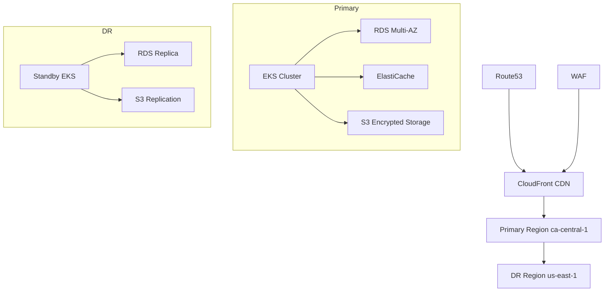

# Estate Kit Infrastructure Documentation

## Table of Contents
- [Overview](#overview)
- [Prerequisites](#prerequisites)
- [AWS Infrastructure](#aws-infrastructure)
- [Security](#security)
- [Disaster Recovery](#disaster-recovery)
- [Maintenance Procedures](#maintenance-procedures)

## Overview

Estate Kit utilizes a highly available, multi-region infrastructure designed to meet stringent security and compliance requirements for estate planning data management.

### Architecture Diagram


### Technology Stack
- **Container Orchestration**: EKS 1.24
- **Database**: RDS PostgreSQL (Multi-AZ)
- **Storage**: S3 with AES-256 encryption
- **CDN**: CloudFront with WAF protection
- **DNS**: Route53 with health checks
- **Security**: AWS KMS, AWS WAF, AWS Shield

## Prerequisites

### Required Tools
| Tool | Version | Purpose |
|------|---------|----------|
| AWS CLI | 2.x+ | AWS infrastructure management |
| kubectl | 1.24+ | Kubernetes cluster management |
| terraform | 1.x+ | Infrastructure as Code |
| docker | 20.x+ | Container management |

### Access Credentials Setup
1. Configure AWS credentials with least privilege principle
```bash
aws configure --profile estate-kit-prod
aws configure --profile estate-kit-dr
```

2. Set up KMS access
```bash
aws kms create-key --description "Estate Kit Encryption Key"
```

### Security-Hardened Development Environment
1. Install security tools
```bash
# Security scanning tools
brew install snyk
brew install trivy

# Compliance checking tools
pip install compliance-checker
```

## AWS Infrastructure

### Multi-Region VPC Configuration
```hcl
# Primary Region (ca-central-1)
module "vpc_primary" {
  source = "./terraform/aws/vpc"
  region = "ca-central-1"
  cidr   = "10.0.0.0/16"
  
  enable_flow_logs = true
  flow_logs_retention = 90
}

# DR Region (us-east-1)
module "vpc_dr" {
  source = "./terraform/aws/vpc"
  region = "us-east-1"
  cidr   = "10.1.0.0/16"
}
```

### EKS Cluster Configuration
```yaml
# kubernetes/cluster-config.yaml
apiVersion: eksctl.io/v1alpha5
kind: ClusterConfig
metadata:
  name: estate-kit-prod
  region: ca-central-1
  version: "1.24"
  
managedNodeGroups:
  - name: managed-nodes
    instanceType: t3.large
    minSize: 3
    maxSize: 10
    volumeSize: 100
    volumeType: gp3
    volumeEncrypted: true
    
securityGroups:
  - name: cluster-sg
    rules:
      - protocol: tcp
        ports: [443, 8443]
        cidrBlocks: [10.0.0.0/16]
```

## Security

### Authentication & Authorization
- JWT-based authentication via Auth0
- RBAC implementation with least privilege
- MFA enforcement for all admin access
- Regular access review and rotation

### Compliance Measures
1. PIPEDA Compliance
   - Data encryption in transit and at rest
   - Privacy impact assessments
   - Regular compliance audits
   - Data retention policies

2. HIPAA Compliance
   - PHI data encryption
   - Access logging and monitoring
   - Business Associate Agreements
   - Security risk assessments

### Network Security
```yaml
# kubernetes/network-policies.yaml
apiVersion: networking.k8s.io/v1
kind: NetworkPolicy
metadata:
  name: default-deny-all
spec:
  podSelector: {}
  policyTypes:
  - Ingress
  - Egress
```

## Disaster Recovery

### Backup Procedures
| Component | Frequency | Retention | Encryption |
|-----------|-----------|-----------|------------|
| RDS | Daily | 30 days | AES-256 |
| S3 | Continuous | 90 days | AES-256 |
| EKS Config | Weekly | 90 days | AES-256 |

### Recovery Process
1. Automated Failover
```bash
# Trigger failover to DR region
aws route53 update-health-check \
  --health-check-id ${HEALTH_CHECK_ID} \
  --regions us-east-1
```

2. Data Synchronization
```bash
# Verify data consistency
aws s3 sync s3://estate-kit-primary s3://estate-kit-dr \
  --sse aws:kms \
  --sse-kms-key-id ${KMS_KEY_ID}
```

## Maintenance Procedures

### Regular Maintenance Schedule
| Task | Frequency | Type | Compliance Check |
|------|-----------|------|-----------------|
| Security Updates | Monthly | Automated | Required |
| Backup Verification | Weekly | Automated | Required |
| Performance Review | Quarterly | Manual | Required |
| DR Testing | Semi-annual | Manual | Required |

### Update Procedures
```bash
# Update EKS cluster
aws eks update-cluster-version \
  --name estate-kit-prod \
  --kubernetes-version 1.24

# Rotate encryption keys
aws kms create-key \
  --description "Estate Kit Encryption Key - $(date +%Y-%m)"
```

### Monitoring Setup
```yaml
# prometheus/alerts.yaml
groups:
- name: estate-kit-alerts
  rules:
  - alert: HighErrorRate
    expr: rate(http_requests_total{status=~"5.."}[5m]) > 0.01
    for: 5m
    labels:
      severity: critical
    annotations:
      description: "High error rate detected"
```

### Compliance Verification
1. Regular Audits
```bash
# Run compliance checks
compliance-checker \
  --standard pipeda \
  --scope "estate-kit-prod" \
  --output-format html \
  > compliance-report-$(date +%Y-%m).html
```

2. Security Assessments
```bash
# Run security scan
trivy k8s --namespace estate-kit-prod
snyk test --severity-threshold=high
```

For detailed configuration files and additional documentation, refer to:
- [Terraform Configurations](./terraform/aws/)
- [Kubernetes Configurations](./kubernetes/)
- [Docker Configurations](./docker/)

## Support and Escalation

### Contact Information
- **Primary Support**: DevOps Team (devops@estatekit.com)
- **Security Team**: security@estatekit.com
- **Emergency Contact**: oncall@estatekit.com

### Escalation Procedure
1. L1 - DevOps Engineer on duty
2. L2 - DevOps Team Lead
3. L3 - CTO/Security Officer