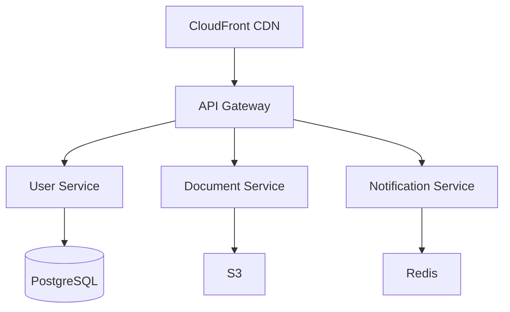

# Estate Kit Backend Service

Enterprise-grade microservices architecture for secure estate planning platform with PIPEDA/HIPAA compliance.

## Table of Contents
- [Overview](#overview)
- [Prerequisites](#prerequisites)
- [Architecture](#architecture)
- [Security](#security)
- [Development Setup](#development-setup)
- [Deployment](#deployment)
- [Maintenance](#maintenance)
- [Troubleshooting](#troubleshooting)

## Overview

Estate Kit's backend service provides a secure, scalable infrastructure for managing estate planning documents and delegate access with bank-level security standards. The system implements a microservices architecture with multi-region deployment capabilities and comprehensive security controls compliant with PIPEDA and HIPAA requirements.

### Key Features
- Secure document storage with AES-256 encryption
- Role-based delegate access management
- Multi-region deployment with disaster recovery
- Real-time notifications system
- Comprehensive audit logging
- PIPEDA and HIPAA compliant security controls

## Prerequisites

### System Requirements
- Node.js v18 LTS
- Python 3.11+
- PostgreSQL 14+
- Redis 6.2+
- Docker and Docker Compose
- Kubernetes CLI (kubectl)
- AWS CLI v2+

### Required Accounts & Credentials
- AWS Account with S3, CloudWatch access
- Auth0 account and credentials
- SendGrid API key

## Architecture

### Microservices Components
1. **API Gateway (Express.js 4.18+)**
   - Request routing and validation
   - Rate limiting and caching
   - JWT authentication
   - API versioning

2. **User Service (FastAPI)**
   - User profile management
   - Delegate access control
   - Authentication workflows
   - RBAC implementation

3. **Document Service (Node.js)**
   - Secure document storage
   - Encryption management
   - Version control
   - Access logging

4. **Notification Service (Python)**
   - Email notifications via SendGrid
   - Event-driven architecture
   - Template management
   - Delivery tracking

### Infrastructure


## Security

### Compliance Framework
- **PIPEDA Compliance**
  - Privacy impact assessments
  - Consent management
  - Data minimization
  - Breach notification procedures

- **HIPAA Controls**
  - PHI protection measures
  - Access control implementation
  - Audit logging
  - Encryption standards

### Security Implementation
```env
# Security Configuration
ENCRYPTION_ALGORITHM=AES-256-GCM
JWT_ALGORITHM=RS256
MFA_REQUIRED=true
SESSION_TIMEOUT=1800
MINIMUM_PASSWORD_LENGTH=12
FAILED_LOGIN_ATTEMPTS=5
```

## Development Setup

### Local Environment
```bash
# Clone repository
git clone https://github.com/estate-kit/backend.git
cd backend

# Install dependencies
npm install
python -m pip install -r requirements.txt

# Configure environment
cp .env.example .env
# Edit .env with your credentials

# Start development environment
docker-compose up -d
```

### Development Tools
- VS Code with recommended extensions
- Postman for API testing
- Git Flow workflow
- ESLint + Prettier configuration

## Deployment

### Multi-Region Setup
```yaml
# kubernetes/production.yaml
apiVersion: apps/v1
kind: Deployment
metadata:
  name: estate-kit-backend
spec:
  replicas: 3
  strategy:
    type: RollingUpdate
  template:
    spec:
      containers:
        - name: api-gateway
          image: estate-kit/api-gateway:latest
          resources:
            requests:
              memory: "2Gi"
              cpu: "1"
            limits:
              memory: "4Gi"
              cpu: "2"
```

### Regions
- Primary: ca-central-1 (Canada)
- DR: us-east-1 (US East)

## Maintenance

### Regular Tasks
1. **Security Audit (Monthly)**
   - Compliance verification
   - Access review
   - Vulnerability scanning
   - Dependency updates

2. **Performance Review (Weekly)**
   - CloudWatch metrics analysis
   - Resource optimization
   - Scaling adjustments
   - Cache hit rates

3. **Disaster Recovery Test (Quarterly)**
   - Multi-region failover
   - Data consistency verification
   - Recovery time objectives
   - Backup validation

## Troubleshooting

### Common Issues

1. **Multi-Region Sync Issues**
   ```bash
   # Verify replication status
   aws s3api get-bucket-replication --bucket estate-kit-documents
   
   # Check CloudWatch metrics
   aws cloudwatch get-metric-statistics --namespace AWS/S3 --metric-name ReplicationLatency
   ```

2. **Security Compliance Verification**
   ```bash
   # Run compliance check
   npm run compliance-check
   
   # Verify audit logs
   aws cloudwatch get-log-events --log-group-name /estate-kit/audit
   ```

3. **Performance Monitoring**
   ```bash
   # Check API latency
   aws cloudwatch get-metric-statistics \
     --namespace EstateKit \
     --metric-name APILatency \
     --period 300 \
     --statistics Average
   ```

## Support

For technical support and questions:
- Email: devops@estate-kit.com
- Internal Documentation: https://docs.estate-kit.internal
- Issue Tracker: https://github.com/estate-kit/backend/issues

## License

Copyright © 2024 Estate Kit. All rights reserved.